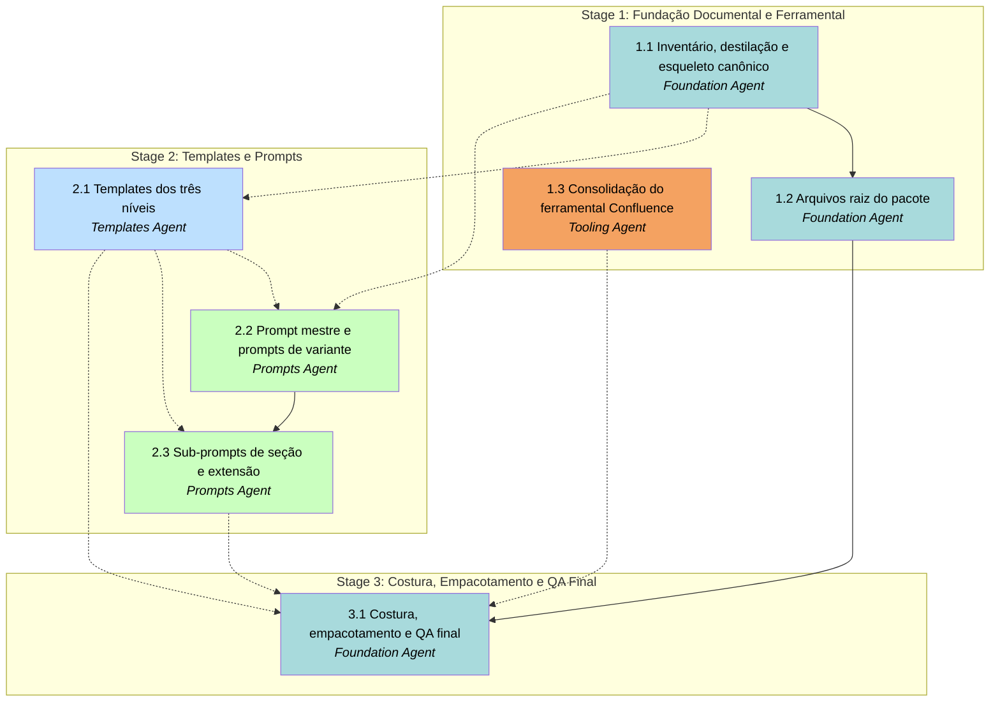

# APM Plan

## Workers

| Worker | Domain | Description |
|---|---|---|
| Foundation Agent | Fundação documental e meta-artefatos | Inventário e destilação das referências existentes; definição do esqueleto canônico de seções; arquivos raiz do pacote (`README.md`, `VERSION`, `guia-humano.md`, `checklist-qa.md`, `glossario-base.md`); costura final e validação estática do pacote completo. |
| Templates Agent | Templates Markdown por nível | Produção dos templates preenchíveis em `templates/L1-essencial/`, `templates/L2-completo/`, `templates/L3-aprofundado/`, incluindo templates condicionais por capacidade. |
| Prompts Agent | Engenharia de prompts orquestrados | Prompt mestre, cinco prompts de variante, sub-prompts de seção do núcleo, nove sub-prompts de extensão por capacidade. |
| Tooling Agent | Ferramental Confluence consolidado | Diff entre as duas versões existentes de `confluence-mermaid-package/`, eleição de versão-base, portabilidade de features distintivas, validação estática do pacote consolidado. |

## Stages

| Stage | Name | Tasks | Agents |
|---|---|---|---|
| 1 | Fundação Documental e Ferramental | 3 | Foundation, Tooling |
| 2 | Templates e Prompts | 3 | Templates, Prompts |
| 3 | Costura, Empacotamento e QA Final | 1 | Foundation |

## Dependency Graph

---

> **Notes:**
> - Estrutura de trabalho favorece dois pontos claros de paralelismo. **Stage 1:** Task 1.3 (Tooling) é completamente independente de 1.1 e 1.2; dispatch paralelo desde o início. **Stage 2:** Tasks 2.1 (Templates) e 2.2 (Prompts) podem ser dispatched em paralelo assim que 1.1 conclui; 2.3 entra em batch sequencial com 2.2 (same-agent), mas precisa esperar 2.1 também por dependência cross-agent.
> - **Caminho crítico:** 1.1 → 2.1 → 2.3 → 3.1, todas envolvendo três agentes distintos (Foundation → Templates → Prompts → Foundation). Convergência final em 3.1 absorve saídas de todos os quatro agentes; Manager deve reservar atenção para garantir que todas as Tasks predecessoras estejam efetivamente fechadas (não apenas marcadas concluídas) antes de iniciar 3.1.
> - **Carga por agente desequilibrada por desenho:** Foundation Agent acumula três Tasks (1.1, 1.2, 3.1) porque detém continuidade conceitual entre fundação inicial, raiz do pacote e revisão integrativa final. Tooling Agent tem uma Task isolada, o que é correto — seu domínio é estreito e técnico.
> - **Pontos naturais de verificação holística** (decisão do Manager se vai envolver o usuário): ao fim de Stage 1 (pacote tem fundação coerente e ferramental funcional?), ao fim de Stage 2 (templates e prompts são consistentes entre si antes da costura?), e ao fim de 3.1 (entrega final). A regra de aceite (4) do Spec, sobre o guia humano ser operável por leitor sem contexto, é o teste de aceitação natural após 3.1.
> - **Aplicação do PADTec a projetos reais é fora deste planejamento** por decisão do usuário (fase posterior). Toda validação aqui é estática contra critérios objetivos — sem execução end-to-end em projeto vizinho. O Manager não deve criar Tasks adicionais para isso sem nova autorização do usuário.
> - **Workspace sob OneDrive:** ver Nota equivalente no Spec. Operações de escrita seguida de leitura imediata podem sofrer atraso de sincronização; recomenda-se separar fases de escrita e leitura quando viável.
> - **Sem repositório git inicializado** no workspace ao tempo do planejamento. Manager estabelece convenções de branch e commit no início da Implementation Phase conforme padrão APM. Tasks deste Plan não dependem de operações git.

## Stage 1: Fundação Documental e Ferramental

### Task 1.1: Inventário, destilação e esqueleto canônico — Foundation Agent

* **Objective:** Destilar padrões reaproveitáveis dos documentos-fonte referenciados e definir o esqueleto canônico de seções do núcleo documental que servirá de contrato para templates e prompts.
* **Output:** `.apm/memory/stage-1/indice-padroes.md` (síntese dos padrões extraídos das referências) e `.apm/memory/stage-1/esqueleto-canonico.md` (lista nomeada de seções do núcleo com formato `NN-nome-secao.md`, nível mínimo de aparição L1/L2/L3, descrição curta, mapeamento para capacidades aplicáveis).
* **Validation:** (a) índice de padrões cobre todos os documentos listados na seção *Documentos-Fonte Referenciados* do Spec — verificar por contagem de entradas; (b) esqueleto canônico contém entrada para cada seção do núcleo com os campos: nome do arquivo, nível mínimo, descrição, capacidades vinculadas; (c) cada capacidade da tabela do Spec aparece mapeada a pelo menos um arquivo de seção condicional; (d) `grep -iE 'NestJS|Next\.js|SQL Server|Redis|TypeORM'` no `esqueleto-canonico.md` retorna zero ocorrências (independência de stack).
* **Guidance:** Documentos-fonte estão enumerados na seção *Documentos-Fonte Referenciados* do Spec — usar exatamente essa lista. Foco da destilação: estruturas de seções recorrentes em docs maduras, padrões de tabelas (rotas, endpoints, módulos, entidades), padrões de diagramas Mermaid utilizados, e diferenças concretas de cobertura observáveis entre `PortalDoAlunoUGD/documentation/` (referência L2) e `SiteUnigrande/docs/` (referência L3). O esqueleto canônico precisa ser independente de stack: listar seções que fazem sentido para qualquer sistema de software; conteúdo específico de variante (ex.: "como documentar módulos NestJS") fica nos prompts de variante, não aqui. Cobertura completa das nove capacidades é obrigatória conforme tabela do Spec. Idioma pt-BR.
* **Dependencies:** None.

1. Listar todos os documentos-fonte da seção *Documentos-Fonte Referenciados* do Spec e ler integralmente.
2. Para cada documento-fonte, extrair em rascunho estrutura de seções, padrões de tabelas, tipos de diagramas Mermaid e indicadores de cobertura por nível.
3. Consolidar achados em `.apm/memory/stage-1/indice-padroes.md` organizados por categoria (estrutura, tabelas, diagramas, cobertura).
4. Derivar esqueleto canônico de seções do núcleo, atribuir nomes definitivos `NN-nome-secao.md` e marcar nível mínimo de aparição.
5. Mapear cada capacidade da tabela do Spec a um arquivo de seção condicional.
6. Executar grep de termos de stack no esqueleto canônico para confirmar independência; corrigir ocorrências eventuais.
7. Validar contra critérios listados em Validation.

### Task 1.2: Arquivos raiz do pacote e estrutura de diretórios — Foundation Agent

* **Objective:** Criar a árvore de diretórios completa do pacote PADTec e produzir os arquivos raiz que definem identidade, operação humana e validação.
* **Output:** árvore completa em `padtec/` conforme seção *Estrutura do Pacote Portátil* do Spec; arquivos `padtec/VERSION`, `padtec/README.md`, `padtec/guia-humano.md`, `padtec/checklist-qa.md` (versão inicial), `padtec/glossario-base.md` (mínimo 30 termos).
* **Validation:** (a) toda a árvore de diretórios da seção *Estrutura do Pacote Portátil* do Spec existe (subpastas vazias incluídas); (b) `padtec/VERSION` contém exatamente `v1.0`; (c) `README.md` cobre identidade, três eixos, lista de variantes, lista de níveis, lista de capacidades, estrutura do pacote, e seção "como começar"; (d) `guia-humano.md` contém sequência operacional passo-a-passo para o usuário (copiar pacote → escolher nível → abrir prompt mestre no Copilot Chat → validar saída); (e) `checklist-qa.md` contém pelo menos um item objetivamente verificável por regra-dura listada na seção *Regras de Qualidade do Conteúdo Gerado* do Spec, mais verificações estruturais (presença de arquivos, contagem); (f) `glossario-base.md` contém no mínimo 30 termos com definição curta; (g) busca por emojis decorativos (🎉 🚀 ✨ 🔥 💪 entre outros) retorna zero ocorrências em todos os arquivos da Task; (h) idioma pt-BR com acentuação correta.
* **Guidance:** Estrutura de diretórios deve replicar exatamente a seção *Estrutura do Pacote Portátil* do Spec — sem arquivos fora dessa árvore. `README.md` descreve identidade, eixos, variantes, níveis, capacidades, estrutura, e ponto de entrada — sem referenciar o Spec do APM (o pacote é autocontido; o leitor do PADTec não tem acesso a este Plan nem ao Spec). `guia-humano.md` é o procedimento passo-a-passo. `checklist-qa.md` inicial cobre as seis regras-duras (uma seção por regra, com itens binários) — refinado depois pela Task 3.1. `glossario-base.md` extrai termos comuns AVP que aparecem repetidamente nos projetos vizinhos a partir da Task 1.1 e leituras pontuais nos próprios projetos quando necessário; é semente para o glossário gerado em cada projeto destino. Tom técnico-formal, sem emojis decorativos.
* **Dependencies:** Task 1.1.

1. Criar a árvore de diretórios completa em `padtec/` incluindo subpastas vazias listadas no Spec.
2. Escrever `padtec/VERSION` com conteúdo `v1.0`.
3. Ler `.apm/memory/stage-1/esqueleto-canonico.md` e `indice-padroes.md` (Task 1.1).
4. Redigir `padtec/README.md` cobrindo todos os tópicos listados na Validation.
5. Redigir `padtec/guia-humano.md` com a sequência operacional.
6. Redigir `padtec/checklist-qa.md` inicial com uma seção por regra-dura do Spec.
7. Redigir `padtec/glossario-base.md` com mínimo de 30 termos extraídos da Task 1.1 e dos projetos vizinhos.
8. Executar busca por emojis decorativos e por termos coloquiais; corrigir ocorrências.
9. Validar contra todos os critérios listados em Validation.

### Task 1.3: Consolidação do ferramental Confluence — Tooling Agent

* **Objective:** Produzir uma versão única e consolidada do `confluence-mermaid-package/` dentro do pacote PADTec a partir das duas instâncias existentes em `SiteUnigrande/` e `PortalDoAlunoUGD/`.
* **Output:** pasta `padtec/confluence-mermaid-package/` contendo scripts consolidados (`convert-md-to-adf.js`, `update-confluence-page.js`, `batch-update-pages.js` e correlatos), `package.json` válido, documentação de instalação/uso, e `CONSOLIDACAO.md` registrando a decisão.
* **Validation:** (a) `padtec/confluence-mermaid-package/` existe e contém pelo menos os scripts equivalentes a `convert-md-to-adf.js`, `update-confluence-page.js`, `batch-update-pages.js`; (b) `package.json` está presente e é JSON parsable; (c) `CONSOLIDACAO.md` existe e registra versão-base eleita, features portadas da outra versão, features descartadas com justificativa, e lista de divergências significativas detectadas no diff; (d) cada arquivo `.js` na raiz do package passa em `node --check` sem erros; (e) há documentação (`INSTALL.md`, `QUICKSTART.md` ou `README.md`) descrevendo configuração de credenciais Atlassian; (f) `node_modules/` **não** está incluído.
* **Guidance:** Versões-fonte estão em `Projetos AVP/SiteUnigrande/confluence-mermaid-package/` e `Projetos AVP/PortalDoAlunoUGD/confluence-mermaid-package/` (somente leitura). Critério de eleição da versão-base, em ordem de desempate: maior número de scripts funcionais distintos → documentação interna mais completa → `package.json` mais recente. Portar da versão não-eleita: scripts ausentes na base, melhorias claras de tratamento de erro, suporte adicional a tipos de diagrama ou de bloco ADF. **Não** rodar `npm install` no pacote — `node_modules/` é antipadrão dentro de pacote distribuído; o usuário instala dependências dentro do projeto destino. Após consolidação, validar com `node --check` em cada `.js` (verificação sintática sem execução). Registrar no `CONSOLIDACAO.md` em pt-BR.
* **Dependencies:** None.

1. Listar conteúdo recursivo das duas versões em `Projetos AVP/SiteUnigrande/confluence-mermaid-package/` e `Projetos AVP/PortalDoAlunoUGD/confluence-mermaid-package/` e gerar diff estrutural (presença/ausência de arquivos).
2. Para cada arquivo comum, diff de conteúdo; classificar divergências por significância (cosmética, funcional, estrutural).
3. Eleger versão-base aplicando critério de desempate definido na Guidance.
4. Copiar versão-base para `padtec/confluence-mermaid-package/`, excluindo qualquer `node_modules/` presente.
5. Portar features distintivas da versão não-eleita, ajustando integração com a base.
6. Redigir `CONSOLIDACAO.md` com versão-base, features portadas, features descartadas (com motivo), e lista de divergências significativas.
7. Executar `node --check` em cada `.js` principal; corrigir erros sintáticos eventuais introduzidos na portabilidade.
8. Confirmar ausência de `node_modules/` e validar `package.json` como JSON parsable.

## Stage 2: Templates e Prompts

### Task 2.1: Templates dos três níveis — Templates Agent

* **Objective:** Produzir todos os templates Markdown preenchíveis para os três níveis de profundidade L1, L2 e L3, incluindo templates condicionais por capacidade.
* **Output:** árvores completas em `padtec/templates/L1-essencial/`, `padtec/templates/L2-completo/` e `padtec/templates/L3-aprofundado/` com todos os arquivos `NN-nome-secao.md` previstos no esqueleto canônico, mais subpastas `condicionais/` em cada nível contendo templates correspondentes às nove capacidades.
* **Validation:** (a) cada arquivo previsto no esqueleto canônico existe na pasta de nível correspondente; (b) todo template contém pelo menos um placeholder explícito e uma instrução-para-IA delimitada; (c) cada template inclui no cabeçalho um comentário listando as regras de qualidade aplicáveis; (d) `grep -riE 'NestJS|Next\.js|SQL Server|Redis|TypeORM|Bull|Prisma' padtec/templates/` retorna zero ocorrências; (e) progressão L1 ⊂ L2 ⊂ L3 verificada (todo arquivo de L1 existe em L2 e L3; todo de L2 existe em L3); (f) cada uma das nove capacidades do Spec tem template condicional correspondente em cada nível aplicável; (g) idioma pt-BR e tom técnico-formal, sem emojis decorativos.
* **Guidance:** Consumir `.apm/memory/stage-1/esqueleto-canonico.md` como definição autoritativa de quais arquivos existem em cada nível. Padrão estrutural de cada template: cabeçalho com lista das regras de qualidade aplicáveis (no formato de comentário ou bloco delimitado); título humanizado; seção por seção com placeholders explícitos (sugestão de convenção: `<<DESCRIÇÃO_DO_QUE_PREENCHER>>`); em cada placeholder, diretiva à IA do tipo `<!-- IA: descreva X com base em Y, citando arquivo:linha -->`. **Zero hardcode de stack** no núcleo — proibido escrever nomes de frameworks ou produtos específicos. Templates condicionais ficam em `templates/<nível>/condicionais/` com mesmo padrão. Progressão entre níveis: L1 contém apenas o subconjunto mínimo (núcleo essencial); L2 contém tudo de L1 mais arquivos adicionais; L3 contém tudo de L2 mais arquivos adicionais. Quando um arquivo de nível inferior é replicado em nível superior, o conteúdo deve ser idêntico (copy fiel) — não diverge entre níveis. Regras de qualidade aplicáveis seguem as seis listadas na seção *Regras de Qualidade do Conteúdo Gerado* do Spec.
* **Dependencies:** **Task 1.1 by Foundation Agent**.

1. Ler `.apm/memory/stage-1/esqueleto-canonico.md` e identificar arquivos por nível.
2. Para cada arquivo de L1, redigir o template com cabeçalho de regras, placeholders e instruções à IA.
3. Em L2, replicar os arquivos de L1 (cópia fiel) e adicionar os novos arquivos do nível.
4. Em L3, replicar os arquivos de L2 e adicionar os novos arquivos do nível.
5. Criar subpastas `condicionais/` em cada nível e produzir templates correspondentes às nove capacidades aplicáveis ao nível.
6. Executar grep automático de hardcode de stack e corrigir ocorrências.
7. Listar arquivos por pasta e verificar progressão L1 ⊂ L2 ⊂ L3.
8. Validar contra todos os critérios listados em Validation.

### Task 2.2: Prompt mestre e prompts de variante — Prompts Agent

* **Objective:** Escrever o orquestrador `00-mestre.md` e os cinco prompts de variante, definindo o contrato que sub-prompts de seção e extensão consomem.
* **Output:** `padtec/prompts/00-mestre.md`; `padtec/prompts/variantes/full-stack-web.md`, `backend-api.md`, `frontend-site.md`, `automacao-script.md`, `iac.md`.
* **Validation:** (a) `00-mestre.md` existe e cobre os sete blocos: identidade, parâmetros de entrada, detecção de variante, detecção de capacidades, detecção de monorepo, sequência de despacho, regras de qualidade replicadas literalmente do Spec; (b) os cinco prompts de variante existem com os slugs exatos definidos na seção *Variantes por Tipo de Sistema* do Spec; (c) cada prompt de variante referencia explicitamente arquivos de template produzidos na Task 2.1 por caminho relativo; (d) o contrato de invocação de sub-prompts está definido em `00-mestre.md` e é consumível pela Task 2.3; (e) os nove sinais técnicos da tabela *Capacidades Técnicas Condicionais* do Spec aparecem literalmente no procedimento de detecção do mestre; (f) busca por strings indicativas de pedir colagem manual ("cole aqui", "paste here", "informe o conteúdo de", "copie e cole") retorna zero ocorrências; (g) idioma pt-BR e tom técnico-formal.
* **Guidance:** O prompt mestre é o ponto único de entrada do usuário no GitHub Copilot Chat e assume tool-calling nativo do agente (leitura automática de arquivos pelo Copilot). Estrutura recomendada do `00-mestre.md`: (i) declaração de identidade ("Você é o orquestrador PADTec v1.0"); (ii) parâmetros de entrada (nível alvo L1/L2/L3 fornecido pelo usuário); (iii) procedimento de detecção de variante a partir de sinais técnicos no projeto destino — manifestos `package.json`, `pom.xml`, `requirements.txt`, `*.csproj`, `go.mod`, presença de pastas `apps/`, `packages/`, `infra/`, `bicep/`; (iv) procedimento de detecção das nove capacidades usando exatamente os sinais listados na tabela do Spec; (v) procedimento de detecção de monorepo conforme Spec (`nx.json`, `pnpm-workspace.yaml`, `lerna.json`, `turbo.json`); (vi) sequência de despacho — em que ordem invocar variante, sub-prompts de seção do núcleo e sub-prompts de extensão; (vii) replicação literal das seis regras-duras de qualidade do Spec. Cada prompt de variante segue padrão: identidade, lista de seções específicas daquela classe de sistema (que estendem o núcleo), exemplos de stack permitidos apenas naquela variante (NestJS/Express em `backend-api`, Next.js/Vite em `frontend-site`, Bicep/Terraform em `iac`, etc.), e referências cruzadas aos templates da Task 2.1. Contrato de invocação de sub-prompts: definir explicitamente no `00-mestre.md` como o agente Copilot Chat referencia/executa um sub-prompt (ex.: "leia e siga as instruções de `padtec/prompts/secoes/<nome>.md` substituindo os parâmetros X, Y, Z"). Idioma pt-BR.
* **Dependencies:** **Task 1.1 by Foundation Agent**, **Task 2.1 by Templates Agent**.

1. Ler `.apm/memory/stage-1/esqueleto-canonico.md` (Task 1.1) e listar os templates produzidos em `padtec/templates/` (Task 2.1).
2. Redigir `padtec/prompts/00-mestre.md` cobrindo os sete blocos da Validation.
3. Definir e documentar dentro do `00-mestre.md` o contrato de invocação de sub-prompts a ser consumido na Task 2.3.
4. Para cada variante (`full-stack-web`, `backend-api`, `frontend-site`, `automacao-script`, `iac`), redigir prompt especializado com seções específicas, exemplos de stack permitidos e referências cruzadas aos templates.
5. Validar busca por hardcode/colar-código.
6. Validar contra todos os critérios listados em Validation.

### Task 2.3: Sub-prompts de seção e extensão — Prompts Agent

* **Objective:** Produzir os sub-prompts autocontidos para cada seção do núcleo e para cada uma das nove capacidades condicionais, segundo o contrato definido pelo prompt mestre.
* **Output:** sub-prompts em `padtec/prompts/secoes/` (um por seção do núcleo conforme esqueleto canônico, mapeamento 1:1 com templates da Task 2.1) e nove sub-prompts em `padtec/prompts/extensoes/` (`banco-de-dados.md`, `cache.md`, `filas-async.md`, `auth.md`, `integracoes-externas.md`, `storage.md`, `notificacoes.md`, `jobs-agendados.md`, `multi-tenancy.md`).
* **Validation:** (a) existe um sub-prompt em `prompts/secoes/` para cada seção do núcleo definida no esqueleto canônico (mapeamento 1:1 com templates produzidos na Task 2.1); (b) existem exatamente nove sub-prompts em `prompts/extensoes/` com os slugs exatos do Spec; (c) cada sub-prompt referencia o template-alvo por caminho relativo; (d) cada sub-prompt inclui literalmente as seis regras de qualidade do Spec; (e) cada sub-prompt de extensão começa declarando o sinal técnico ativador conforme tabela do Spec; (f) consistência cruzada template ↔ sub-prompt: para cada arquivo de template do núcleo, existe sub-prompt de seção correspondente, e vice-versa; (g) busca por strings de colagem manual retorna zero ocorrências; (h) idioma pt-BR e tom técnico-formal.
* **Guidance:** Cada sub-prompt é autocontido — execução isolada deve produzir o artefato esperado sem depender de estado compartilhado. Estrutura padrão: (i) identidade ("Você é o gerador da seção X do PADTec"); (ii) insumos (qual template ler em `padtec/templates/<nível>/...`, qual variante orienta a abordagem se aplicável); (iii) procedimento de exploração no projeto destino (que arquivos ler, que padrões procurar, como confirmar evidência rastreável); (iv) preenchimento (mapear achados nos placeholders do template, gerar tabelas exigidas pela regra de cobertura exaustiva); (v) replicação literal das seis regras de qualidade do Spec; (vi) saída (caminho de arquivo `docs/NN-nome-secao.md` no projeto destino). Sub-prompts de extensão começam declarando o sinal técnico que os ativa — assim, se forem executados fora do orquestrador, eles mesmos confirmam que a capacidade está presente no código. Convergência: a Task 2.1 produziu templates, a Task 2.2 produziu orquestrador e variantes; aqui produzimos a ponte que opera a geração. Idioma pt-BR.
* **Dependencies:** Task 2.2, **Task 2.1 by Templates Agent**, **Task 1.1 by Foundation Agent**.

1. Ler `padtec/prompts/00-mestre.md` (Task 2.2) e internalizar o contrato de invocação.
2. Listar todas as seções do núcleo conforme esqueleto canônico (Task 1.1) e os templates correspondentes (Task 2.1).
3. Redigir cada sub-prompt de seção do núcleo, mapeando 1:1 com template e seguindo o padrão estrutural definido na Guidance.
4. Redigir os nove sub-prompts de extensão (um por capacidade), cada um declarando o sinal técnico ativador.
5. Verificar consistência cruzada template ↔ sub-prompt (listar arquivos e confirmar pareamento sem órfãos).
6. Validar busca por hardcode/colar-código e contra todos os critérios listados em Validation.

## Stage 3: Costura, Empacotamento e QA Final

### Task 3.1: Costura, empacotamento e QA final — Foundation Agent

* **Objective:** Revisar o pacote PADTec inteiro produzido nos Stages 1 e 2, corrigir incoerências cruzadas detectadas, finalizar o checklist QA contra o produto real e alinhar guia humano e README ao pacote entregue.
* **Output:** pacote `padtec/` revisado e coerente; `padtec/checklist-qa.md` finalizado (refinando a versão inicial da Task 1.2); `padtec/guia-humano.md` ajustado; `padtec/README.md` ajustado se necessário; `.apm/memory/stage-3/correcoes.md` registrando correções aplicadas.
* **Validation:** (a) listagem de templates de seção e de sub-prompts de seção produz mapeamento 1:1 sem órfãos em nenhum dos lados; (b) `grep` por cada slug de variante, nível e capacidade definido no Spec confirma presença consistente em prompts, templates e checklist; (c) todos os caminhos referenciados em `padtec/prompts/00-mestre.md` apontam para arquivos existentes no pacote; (d) aplicação mental do `checklist-qa.md` ao próprio pacote resolve cada item para ✅ ou registra ação de correção realizada; (e) leitura do `guia-humano.md` sem contexto prévio descreve sequência operacional completa e executável com os artefatos efetivamente entregues; (f) `.apm/memory/stage-3/correcoes.md` existe registrando correções aplicadas, ou contém literal "Nenhuma correção necessária" se aplicável; (g) `padtec/VERSION` continua exatamente `v1.0`.
* **Guidance:** Esta é Task de revisão integrativa, não de criação de novos artefatos do produto. Aspectos a verificar cruzadamente: cada template tem sub-prompt correspondente e vice-versa; slugs de variante/nível/capacidade aparecem consistentemente em todos os artefatos; `00-mestre.md` referencia caminhos válidos; checklist QA cobre todas as regras-duras e tem itens objetivamente verificáveis (refinar itens vagos detectados); guia humano descreve operação efetivamente realizável; README descreve o pacote como entregue. Onde houver incoerência, corrigir nos arquivos de origem (Stage 1 ou 2) — não criar arquivos adicionais para "corrigir". Não rodar o PADTec contra projeto vizinho real (validação aplicada é fase posterior, fora deste escopo). Validação é estritamente estática. Documentar correções relevantes em `.apm/memory/stage-3/correcoes.md` em pt-BR.
* **Dependencies:** Task 1.2, **Task 2.1 by Templates Agent**, Task 2.3, **Task 1.3 by Tooling Agent**.

1. Listar recursivamente todos os arquivos de `padtec/` e mapear template ↔ sub-prompt 1:1.
2. Para cada incoerência detectada (órfão, slug divergente, caminho inválido), abrir o arquivo de origem no Stage correspondente e aplicar correção.
3. Validar que todos os caminhos referenciados em `padtec/prompts/00-mestre.md` existem.
4. Aplicar mentalmente cada item do `padtec/checklist-qa.md` ao próprio pacote; refinar itens vagos para que sejam objetivamente verificáveis.
5. Reler `padtec/guia-humano.md` simulando usuário sem contexto prévio; ajustar onde houver lacuna operacional.
6. Reler `padtec/README.md` e atualizar se estrutura ou listagens mudaram durante a costura.
7. Confirmar que `padtec/VERSION` contém exatamente `v1.0`.
8. Registrar correções aplicadas em `.apm/memory/stage-3/correcoes.md` (ou registrar "Nenhuma correção necessária" se for o caso).
