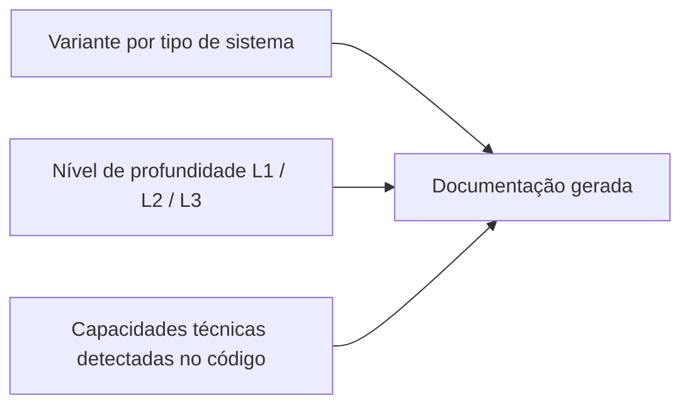
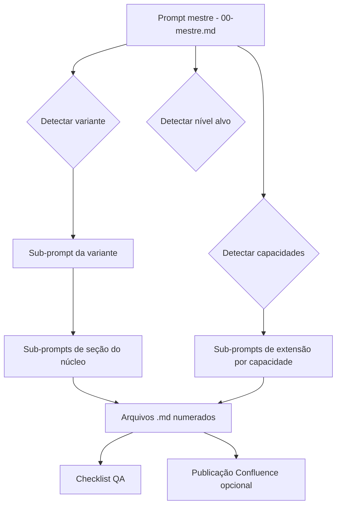

# APM Spec

## Overview

PADTec (Padrão AVP de Documentação Técnica) é um pacote portátil de documentação técnica reversa — esqueleto, prompts e ferramental — que permite gerar documentação completa de sistemas de software já em produção a partir da leitura do seu código-fonte. Substitui o padrão informal "APM Fases 1-7" hoje espalhado entre os projetos em `Projetos AVP/`. O entregável é o pacote PADTec v1.0 propriamente dito (templates, prompts orquestrados, checklist de QA, guia humano e ferramental Confluence consolidado), pronto para ser copiado para dentro de qualquer projeto. Sucesso significa que, ao copiar o pacote para um projeto destino e executar o prompt mestre no GitHub Copilot Chat, o usuário obtém documentação técnica consistente, rastreável ao código e padronizada, sem intervenção manual estrutural. A aplicação do PADTec aos projetos existentes é fase posterior, fora deste escopo.

## Workspace

- **Working target:** `Centralizador de Docs/` (este workspace) — local único onde o PADTec é construído. Todo artefato produzido fica em `padtec/` na raiz deste workspace.
- **Read-only references:** todas as pastas em `Projetos AVP/` (um nível acima). São fontes para destilação de padrões e referências de stack; qualquer escrita nessas pastas é violação de escopo.
- **`AGENTS.md`:** não existe no workspace; será criado do zero contendo apenas o bloco `APM_RULES`.
- **Controle de versão:** workspace não possui repositório git inicializado no momento do planejamento. Manager estabelece convenções no início da Implementation Phase.

---

> **Notes:**
> - Workspace está sob sincronização do OneDrive. Operações que dependem de leitura imediata após gravação podem sofrer atraso de sync; preferir ler arquivos em momento separado da escrita.
> - Os projetos em `Projetos AVP/` são exclusivamente de leitura; qualquer Task que precise inspecionar código alheio deve operar em modo read-only.
> - Usuário declarou preferência forte por português do Brasil com acentuação correta em todo conteúdo gerado, incluindo nomes de arquivos do pacote PADTec.
> - As duas instâncias existentes do `confluence-mermaid-package` (em `SiteUnigrande/` e `PortalDoAlunoUGD/`) divergem; a consolidação é Task explícita no Plan e requer comparação por diff antes de eleger versão-base.
> - Tracker, Memory Index e bus directories ainda não foram inicializados — Planner inicializa o bus ao final da Planning Phase.

## Identidade e Distribuição

- **Nome canônico:** PADTec — Padrão AVP de Documentação Técnica.
- **Versão a ser produzida:** v1.0.
- **Versionamento próprio:** o pacote contém arquivo `VERSION` na raiz, formato `vMAJOR.MINOR` (ex.: `v1.0`). Projetos consumidores referenciam a versão instalada para rastrear drift.
- **Modelo de distribuição:** cópia integral da pasta `padtec/` para dentro de cada projeto destino. Sem dependência de instalação remota, sem submodule, sem package manager. O modelo segue o precedente do `confluence-mermaid-package` já estabelecido nos projetos AVP.
- **Plataforma alvo de execução dos prompts:** GitHub Copilot Chat dentro do VS Code, assumindo tool-calling nativo (leitura automática de arquivos pelo agente). Os prompts não instruem o usuário a colar trechos de código.
- **Origem metodológica:** engenharia reversa documental — o fluxo é código-fonte → documentação. PADTec não é metodologia de documentação para projetos novos a partir de requisitos.

## Arquitetura Conceitual

A geração de documentação por PADTec é parametrizada por **três eixos ortogonais** combinados em cada execução:



Cada execução do prompt mestre resolve, nesta ordem: variante (qual tipo de sistema), nível (qual profundidade de documentação produzir), e capacidades (quais seções condicionais ativar com base em sinais detectados no código). O cruzamento dos três determina o subconjunto de sub-prompts a executar e o template a preencher.

## Variantes por Tipo de Sistema

PADTec v1.0 cobre cinco variantes. Cada variante possui prompt especializado próprio em `padtec/prompts/variantes/`.

| Variante | Slug do prompt | Aplicação típica |
|---|---|---|
| Full-stack Web | `full-stack-web` | Sistemas com backend API + frontend acoplado (maioria dos projetos AVP) |
| Backend / API isolada | `backend-api` | Serviços que expõem apenas API, sem frontend acoplado |
| Frontend / Site isolado | `frontend-site` | SPAs, sites estáticos, frontends sem backend próprio |
| Automação / Script / CLI | `automacao-script` | Processadores de dados, scripts, utilitários sem servidor |
| Infraestrutura como Código | `iac` | Bicep, Terraform, scripts de provisionamento |

**Monorepo multi-app** é tratado como **extensão** das variantes Full-stack Web ou Backend/API — não como variante própria. O prompt mestre detecta sinais de monorepo (presença de `nx.json`, `pnpm-workspace.yaml`, `lerna.json`, `turbo.json`, múltiplos `package.json` em estrutura `apps/`/`packages/`) e ativa documentação extra de workspace + por app.

**Fora de escopo das variantes v1.0:** documentação de processos AS-IS/TO-BE (categoria observada em `Processos_docentes/` mas explicitamente excluída).

## Níveis de Profundidade

Três níveis, materializados como pastas independentes de templates em `padtec/templates/`:

| Nível | Pasta | Volume aproximado | Aplicação típica |
|---|---|---|---|
| L1 Essencial | `templates/L1-essencial/` | README robusto + 1 documento de arquitetura | Scripts, automações, IaC, PoCs |
| L2 Completo | `templates/L2-completo/` | 10–14 documentos numerados | Sistemas em produção de complexidade média |
| L3 Aprofundado | `templates/L3-aprofundado/` | ~30 documentos numerados | Sistemas críticos, alto tráfego, multi-módulo |

A escolha do nível é parâmetro de entrada do prompt mestre. Cada nível é superconjunto do anterior em termos de cobertura.

## Capacidades Técnicas Condicionais

Seções condicionais são ativadas pelo prompt mestre quando o sinal técnico correspondente é detectado no código. Cada capacidade tem sub-prompt dedicado em `padtec/prompts/extensoes/`.

| Capacidade | Slug da extensão | Sinais técnicos no código |
|---|---|---|
| Banco de dados | `banco-de-dados` | TypeORM, Prisma, Sequelize, arquivos `.sql`, migrations, schema files |
| Cache | `cache` | Redis, `cache-manager`, `ioredis`, decorators de cache |
| Filas / Processamento assíncrono | `filas-async` | Bull, BullMQ, RabbitMQ, Kafka, SQS, decorators `@Process` |
| Autenticação e autorização | `auth` | passport, JWT, OAuth, OpenID, guards de auth, middlewares de sessão |
| Integrações externas | `integracoes-externas` | clientes HTTP nomeados, SDKs de terceiros (axios com baseURL fixa, SDKs de provedores) |
| Armazenamento de arquivos | `storage` | Azure Blob, AWS S3, multer, fs-extra usado para upload |
| Notificações | `notificacoes` | SendGrid, Twilio, nodemailer, SMTP, push notification SDKs |
| Jobs agendados | `jobs-agendados` | `@nestjs/schedule`, `node-cron`, cron jobs declarados |
| Multi-tenancy | `multi-tenancy` | múltiplas conexões nomeadas, schemas dinâmicos, tenant resolvers |

A lista é **extensível** — sub-prompts adicionais podem ser introduzidos em versões futuras do PADTec sem quebrar o orquestrador, desde que respeitem o contrato de detecção por sinal.

## Design dos Prompts — Orquestração Híbrida

PADTec utiliza arquitetura **orquestrada híbrida**:



- **Prompt mestre (`prompts/00-mestre.md`):** ponto único de entrada. Recebe do usuário o nível alvo. Lê o código do projeto, detecta variante, detecta capacidades presentes, despacha sub-prompts na ordem correta.
- **Sub-prompts de variante (`prompts/variantes/`):** um por variante. Definem seções específicas daquela classe de sistema.
- **Sub-prompts de seção (`prompts/secoes/`):** unidades atômicas de geração de um documento (`NN-nome-secao.md`).
- **Sub-prompts de extensão (`prompts/extensoes/`):** um por capacidade condicional. Adicionam seções/arquivos quando o sinal é detectado.

Cada sub-prompt é **autocontido**: contém o template-alvo, as regras de qualidade aplicáveis, e as instruções de exploração do código necessárias para produzir seu artefato. Sub-prompts não dependem de estado compartilhado entre execuções.

## Formato dos Artefatos de Saída

Conteúdo gerado por execução do PADTec em um projeto destino:

- **Estrutura de arquivos:** múltiplos `.md` numerados no padrão `NN-nome-secao.md` (ex.: `01-visao-geral.md`, `02-arquitetura.md`). Numeração começa em `01` e segue ordem de leitura recomendada.
- **Local de saída no projeto destino:** pasta `docs/` (ou equivalente já existente — o prompt mestre detecta `docs/`, `documentation/`, `documentacao/`).
- **Idioma:** português do Brasil, acentuação correta, ortografia conforme norma padrão.
- **Tom:** técnico-formal. Identidade visual profissional/neutra — emojis decorativos são proibidos; ícones funcionais (ex.: `✅`/`❌` em checklists) são permitidos quando carregam significado.
- **Publicação Confluence:** opcional. Quando o projeto destino possui ambiente Confluence configurado, o ferramental incluído converte Markdown em ADF com Mermaid macro.

## Diagramas

- **Formato canônico único:** Mermaid. Justificativa: compatível com Markdown nativo, com VS Code, e com Confluence via macro do ferramental incluído.
- **Obrigatórios em qualquer nível (L1/L2/L3):**
  - Diagrama de **contexto** — sistema como caixa-preta com atores e dependências externas.
  - Diagrama de **componentes internos** — principais módulos/serviços do sistema.
- **Adicionais em L3:**
  - Diagramas de **sequência/fluxo** detalhados (autenticação, fluxos críticos de negócio).
  - **ERD completo** (quando capacidade Banco de Dados está ativa).
  - **Topologia de deployment** (quando há infraestrutura documentável).

## Regras de Qualidade do Conteúdo Gerado

Regras de produto impostas a **toda documentação produzida** por execução do PADTec. Os sub-prompts internalizam estas regras; o checklist de QA verifica cumprimento.

1. **Evidência rastreável.** Toda afirmação técnica em conteúdo gerado deve citar `arquivo:linha` (ou `arquivo`, quando a evidência é estrutural e não pontual) do código-fonte do projeto destino. Formato sugerido: nota de rodapé ou citação inline.
2. **Anti-alucinação.** Quando o sub-prompt requisita uma seção mas a evidência não é encontrada no código, o conteúdo gerado registra o marcador literal `// CARÊNCIA: não identificado no código` no lugar da afirmação. Proibido inferir além do código.
3. **Glossário mínimo.** Toda execução produz um documento de glossário com no mínimo **30 termos** identificados no código (nomes de domínio, entidades, abreviações usadas no projeto). Em L2 o mínimo sobe para 60; em L3, 100.
4. **Cobertura exaustiva.** Toda rota HTTP, endpoint, módulo, classe-controlador, entidade de persistência e job encontrado no código aparece em alguma tabela do conteúdo gerado. Cobertura não-exaustiva é falha de QA.
5. **Versões exatas.** Toda versão de runtime, framework ou biblioteca-chave citada deve ser versão exata (pinada conforme aparece no manifesto), nunca range. Quando o manifesto registra range (ex.: `^10.0.0`), o conteúdo gerado registra o range literal entre crases e a versão resolvida do lockfile separadamente.
6. **Sem estimativas.** Conteúdo gerado não contém estimativas de tempo, custo ou esforço. Cronogramas, "X dias", "Y horas", projeções financeiras são proibidos.

## Ferramental Confluence Consolidado

- **Componente:** `padtec/confluence-mermaid-package/` — versão consolidada única a partir das duas instâncias existentes (`Projetos AVP/SiteUnigrande/confluence-mermaid-package/` e `Projetos AVP/PortalDoAlunoUGD/confluence-mermaid-package/`).
- **Função:** converter Markdown (com diagramas Mermaid) em Atlassian Document Format (ADF) e publicar em páginas Confluence.
- **Independência:** o componente é **opcional** dentro do PADTec. O núcleo documental funciona apenas com Markdown — projetos que não usam Confluence ou que não são baseados em Node.js podem ignorar este componente sem prejuízo.
- **Stack:** Node.js (mantém a stack do componente original; nenhum projeto não-Node fica bloqueado porque o uso é opcional).
- **Critério de consolidação:** comparar diff entre as duas versões existentes, eleger a versão de referência (decisão registrada em log de execução), portar features distintivas da outra, validar manualmente que o pacote ainda funciona após consolidação.

## Estrutura do Pacote Portátil

```
padtec/
├── README.md                          # O que é o PADTec, visão geral, como começar
├── VERSION                            # vMAJOR.MINOR (ex.: v1.0)
├── guia-humano.md                     # Guia operacional para o usuário (passo a passo)
├── prompts/
│   ├── 00-mestre.md                   # Orquestrador (ponto único de entrada)
│   ├── variantes/
│   │   ├── full-stack-web.md
│   │   ├── backend-api.md
│   │   ├── frontend-site.md
│   │   ├── automacao-script.md
│   │   └── iac.md
│   ├── secoes/                        # Sub-prompts por seção do núcleo
│   └── extensoes/                     # Sub-prompts por capacidade condicional
├── templates/
│   ├── L1-essencial/
│   ├── L2-completo/
│   └── L3-aprofundado/
├── checklist-qa.md                    # Validação da documentação produzida
├── glossario-base.md                  # Termos comuns AVP pré-preenchidos (semente)
└── confluence-mermaid-package/        # Ferramental opcional de publicação
```

Nenhum arquivo fora dessa árvore. Toda referência interna do pacote usa caminhos relativos a `padtec/`.

## Critérios de Aceite dos Entregáveis do PADTec

Critérios objetivos para considerar cada classe de entregável "pronta". Verificados pelo Worker durante validação de Task; o checklist de QA do produto final é entregável separado.

1. **Templates Markdown.** Toda seção contém: (a) placeholder explícito, (b) instrução-para-IA delimitada que descreve o que produzir, (c) referência às regras de qualidade aplicáveis. Zero hardcode de stack específica (NestJS, Next.js, SQL Server, Redis) em templates do núcleo — exemplos de stack ficam confinados a sub-prompts de variante.
2. **Prompts.** Ao serem revisados pelo Worker contra um projeto-amostra real (escolhido entre as referências citadas), a inspeção confirma que os prompts dispararão a geração das seções aplicáveis e respeitam as Regras de Qualidade do Conteúdo Gerado. Execução end-to-end em projeto real fica para a fase posterior.
3. **Checklist QA.** Todos os itens são **objetivamente verificáveis** — cada item resolve para sim/não, contagem numérica, ou presença/ausência de arquivo. Nenhum item subjetivo do tipo "está bem escrito".
4. **Guia humano.** Leitor sem contexto prévio sobre PADTec consegue, lendo apenas o guia, executar do zero a sequência: copiar pacote para projeto destino, escolher nível, executar prompt mestre, validar saída com checklist. Validado por dry-read pelo próprio Worker antes de fechar a Task.

## Documentos-Fonte Referenciados

Artefatos pré-existentes que são fontes de conteúdo ou padrões para destilação. Referenciados por caminho, **não duplicados** no PADTec.

| Caminho | Uso no PADTec |
|---|---|
| `Projetos AVP/SiteUnigrande/apm-complete-guide-phases-1-7.md` | Insumo histórico de processo; conteúdo destilado para templates L3 |
| `Projetos AVP/SiteUnigrande/apm-7-confluence-documentation-template.md` | Base estrutural do template de publicação Confluence |
| `Projetos AVP/PortalDoAlunoUGD/confluence-mermaid-package/` | Versão de referência primária para consolidação do ferramental |
| `Projetos AVP/SiteUnigrande/confluence-mermaid-package/` | Versão alternativa para diff e portabilidade de features |
| `Projetos AVP/Processos_docentes/APM_RULES.md` | Referência estrutural (estilo, não conteúdo) para `AGENTS.md` |
| `Projetos AVP/siteavp-docs/docs/00-baseline-referencia-siteavp-docs.md` | Insumo meta-documental para o guia humano |
| `Projetos AVP/siteavp-docs/docs/01-estrutura-canonica-documental.md` | Insumo meta-documental para o guia humano |
| `Projetos AVP/SiteUnigrande/docs/` (32 arquivos) | Amostra de referência de documentação L3 madura |
| `Projetos AVP/PortalDoAlunoUGD/documentation/` (11 arquivos) | Amostra de referência de documentação L2 |
| `Projetos AVP/DocBox/docs/` | Amostra de referência de documentação com diagramas e evidências visuais |

## Fora de Escopo

- **Custos financeiros** e qualquer projeção de FinOps no conteúdo gerado pelo PADTec.
- **Estimativas de tempo/esforço** no conteúdo gerado.
- **Documentação de processos AS-IS/TO-BE** (categoria distinta de documentação técnica de software).
- **Aplicação do PADTec a projetos reais** — fase posterior, fora deste planejamento. Inclui: aplicar a `SiteUnigrande`, `PortalDoAlunoUGD`, `DocBox` etc. para validar e re-padronizar; consolidar Confluence existente; migrar docs antigas para o novo padrão.
- **Substituição ou modificação dos guias APM da sessão** (`Centralizador de Docs/.github/apm-guides/`) — esses guias governam esta sessão APM, não o PADTec.
- **Distribuição via package manager, submodule git, ou repositório central** — modelo é cópia explícita.
