# 📘 Guia Completo de Mermaid para Confluence

**Tudo que você precisa saber sobre diagramas Mermaid no Confluence**

---

## 🎯 Introdução

Mermaid é uma linguagem de diagramação baseada em texto que permite criar:
- Fluxogramas
- Diagramas de sequência
- Diagramas de classes
- Diagramas ER
- Gráficos Gantt
- E muito mais!

**Vantagens:**
- ✅ Versionável (texto puro)
- ✅ Fácil de editar
- ✅ Sem ferramentas gráficas necessárias
- ✅ Integração perfeita com Markdown
- ✅ Renderização automática no Confluence

---

## 🚀 Sintaxe Básica

### Estrutura de um Diagrama

````markdown
```mermaid
TIPO
    conteúdo do diagrama
    definições
    relações
```
````

**Tipos disponíveis:**
- `graph` (fluxograma)
- `sequenceDiagram`
- `classDiagram`
- `stateDiagram-v2`
- `erDiagram`
- `gantt`
- `pie`
- `journey`
- `gitGraph`
- `mindmap`
- `timeline`
- `quadrantChart`

---

## 📊 Tipos de Diagramas Detalhados

### 1. Fluxogramas (Flowcharts)

**Direções:**
- `TD` / `TB` = Top to bottom (vertical)
- `LR` = Left to right (horizontal)
- `BT` = Bottom to top
- `RL` = Right to left

**Formas de nós:**

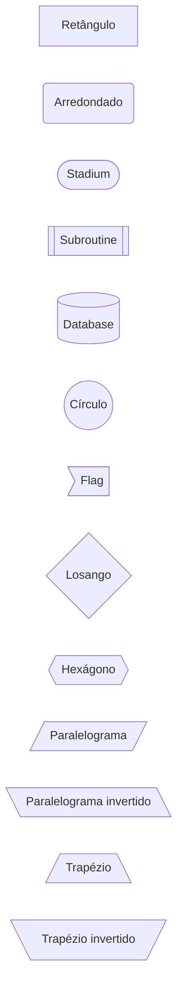

**Tipos de setas:**

```mermaid
graph LR
    A --> B
    C --- D
    E -.-> F
    G ==> H
    I --texto--> J
    K -.texto.-> L
    M ==texto==> N
```

**Subgrafos:**

````markdown
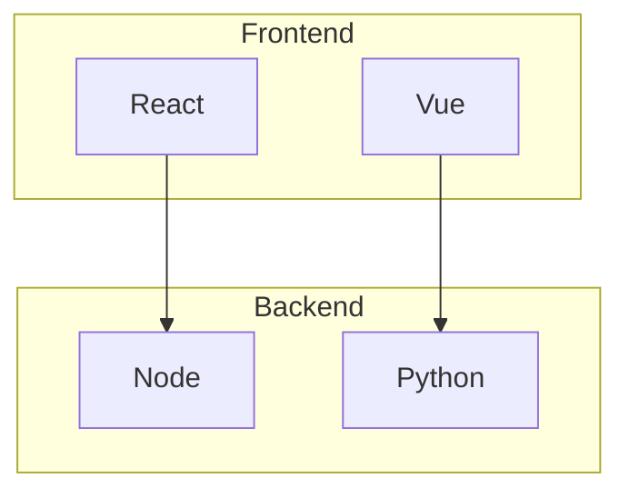
````

---

### 2. Diagramas de Sequência

**Elementos principais:**

````markdown
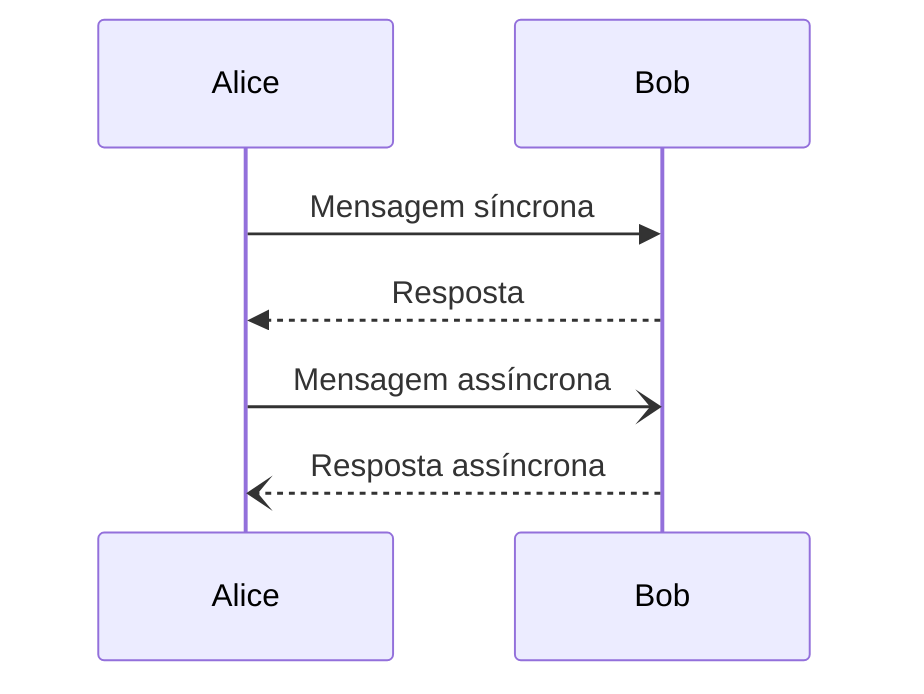
````

**Recursos avançados:**

````markdown
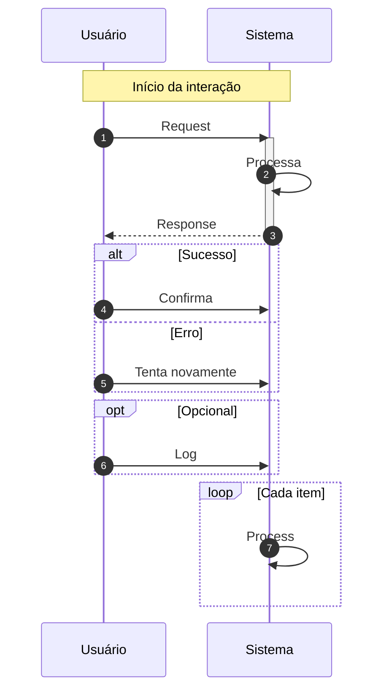
````

**Tipos de setas:**
- `->` linha sólida sem seta
- `-->` linha pontilhada sem seta
- `->>` linha sólida com seta
- `-->>` linha pontilhada com seta
- `-x` linha sólida com X (erro)
- `--x` linha pontilhada com X
- `-)` linha sólida assíncrona
- `--)` linha pontilhada assíncrona

---

### 3. Diagramas de Classes

````markdown
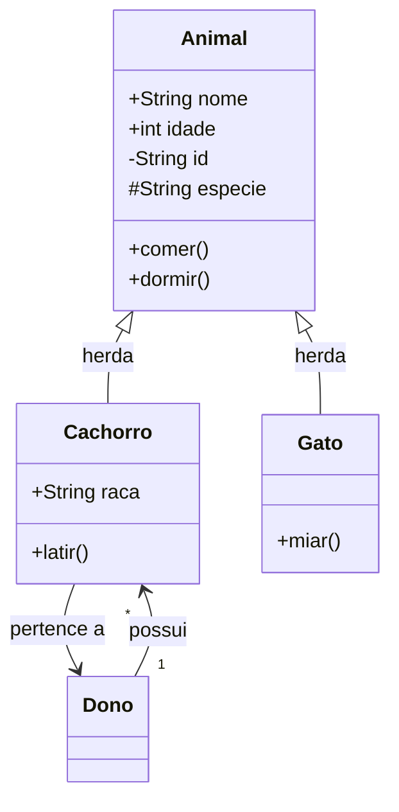
````

**Visibilidade:**
- `+` Public
- `-` Private
- `#` Protected
- `~` Package

**Tipos de relações:**
- `<|--` Herança
- `*--` Composição
- `o--` Agregação
- `-->` Associação
- `--` Link (linha sólida)
- `..>` Dependência
- `..|>` Realização

**Cardinalidade:**
- `"1"` exatamente um
- `"0..1"` zero ou um
- `"1..*"` um ou mais
- `"*"` muitos
- `"n"` n (variável)

---

### 4. Diagramas de Estado

````markdown
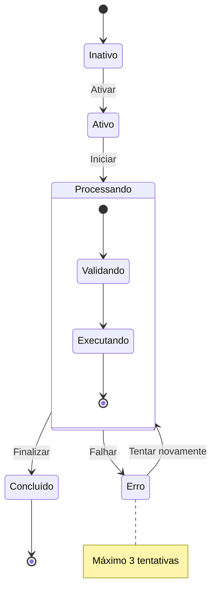
````

---

### 5. Diagramas ER (Entity-Relationship)

````markdown
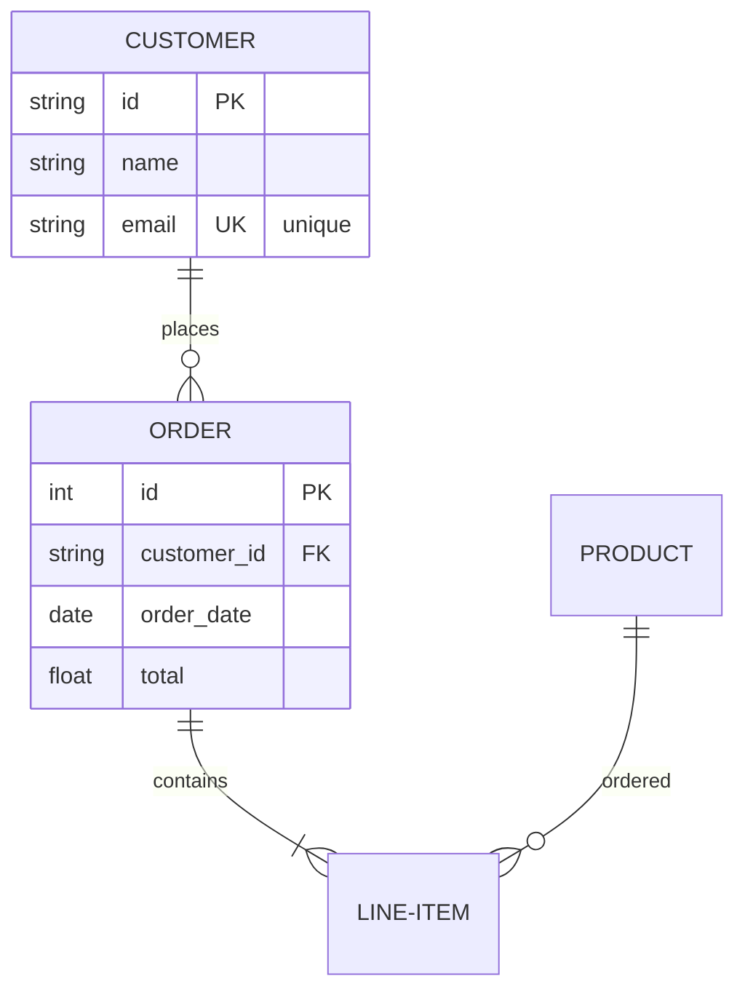
````

**Cardinalidade:**
- `||` exatamente um
- `|o` zero ou um
- `}|` um ou muitos
- `}o` zero ou muitos

**Atributos:**
- `PK` Primary Key
- `FK` Foreign Key
- `UK` Unique Key

---

### 6. Gráficos Gantt

````markdown
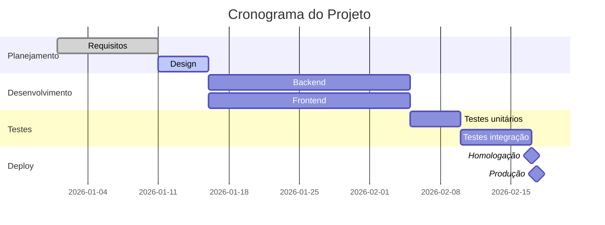
````

**Status:**
- `done` Concluído (verde)
- `active` Em progresso (azul)
- `crit` Crítico (vermelho)
- `milestone` Marco (diamante)

---

## 🎨 Estilização e Customização

### Cores e Estilos

````markdown
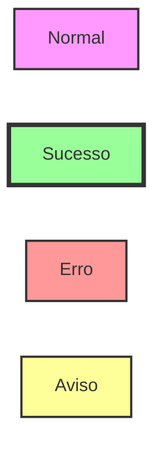
````

### Classes de Estilo

````markdown
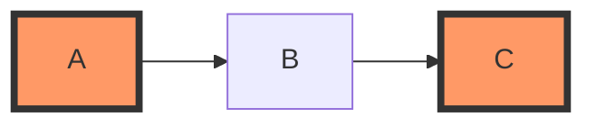
````

### Cores Pré-definidas

```css
/* Cores comuns */
fill:#90EE90  /* Verde claro - Sucesso */
fill:#FFB6C1  /* Rosa claro - Erro */
fill:#FFD700  /* Amarelo - Aviso */
fill:#87CEEB  /* Azul claro - Info */
fill:#DDA0DD  /* Roxo claro - Destaque */
```

---

## 💡 Dicas e Boas Práticas

### ✅ DO - Faça

1. **Mantenha diagramas simples**
   - Máximo 15-20 nós por diagrama
   - Se ficar muito grande, divida em múltiplos diagramas

2. **Use nomes descritivos**
   ```mermaid
   graph LR
       UserService --> DatabaseConnection
       DatabaseConnection --> PostgreSQL
   ```

3. **Adicione notas explicativas**
   ```mermaid
   graph TD
       A[Processo] --> B[Validação]
       note right of B: Valida contra regex
   ```

4. **Agrupe elementos relacionados**
   ```mermaid
   graph TB
       subgraph "Camada de Apresentação"
           A[Controller]
       end
       subgraph "Camada de Negócio"
           B[Service]
       end
   ```

5. **Use estilos para destacar**
   ```mermaid
   graph LR
       A[Input] --> B{Valid?}
       B -->|Yes| C[Process]
       B -->|No| D[Error]
       style D fill:#f99
   ```

### ❌ DON'T - Não faça

1. **Não crie diagramas muito complexos**
   ```
   ❌ 50+ nós em um único diagrama
   ✅ Múltiplos diagramas menores e focados
   ```

2. **Não use abreviações obscuras**
   ```
   ❌ graph LR; USR --> DB
   ✅ graph LR; UserService --> Database
   ```

3. **Não misture conceitos**
   ```
   ❌ Misturar arquitetura de alto nível com detalhes de implementação
   ✅ Um diagrama para arquitetura, outro para implementação
   ```

4. **Não ignore a direção**
   ```
   ❌ Setas indo em todas as direções (confuso)
   ✅ Fluxo consistente (top-down ou left-right)
   ```

---

## 🔧 Troubleshooting

### Problema: Diagrama não renderiza

**Possíveis causas:**
1. Sintaxe incorreta
2. Macro não instalado
3. ADF estruturado incorretamente

**Soluções:**
1. Teste no [Mermaid Live Editor](https://mermaid.live/)
2. Instale [Mermaid for Confluence](https://marketplace.atlassian.com/apps/1222792/)
3. Use o conversor deste pacote

---

### Problema: Texto cortado ou sobreposto

**Causa:** Nomes muito longos

**Solução:** Use quebras de linha ou abreviações


---

### Problema: Setas confusas

**Causa:** Muitas conexões cruzadas

**Solução:** Reorganize a ordem dos nós ou use subgrafos

---

## 📚 Exemplos Práticos

### Sistema de Autenticação

````markdown
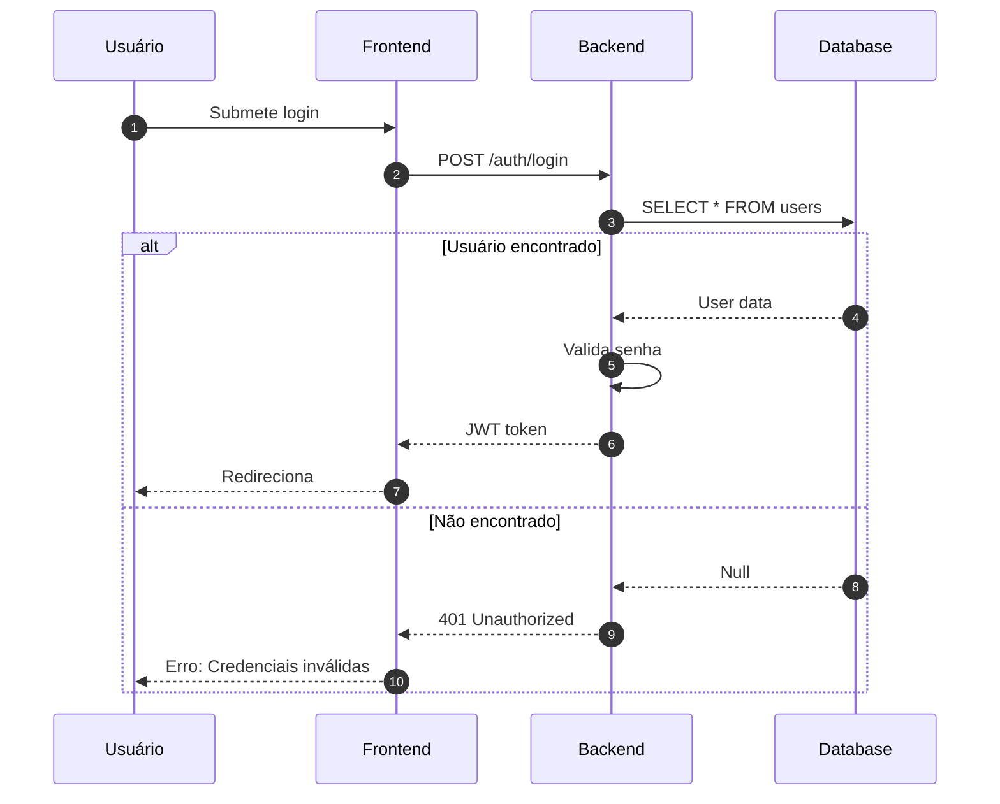
````

---

### Máquina de Estados de Pedido

````markdown
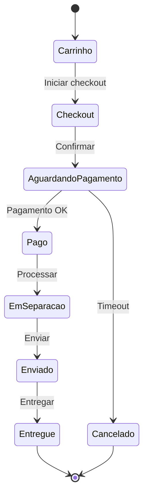
````

---

### Arquitetura de Microserviços

````markdown
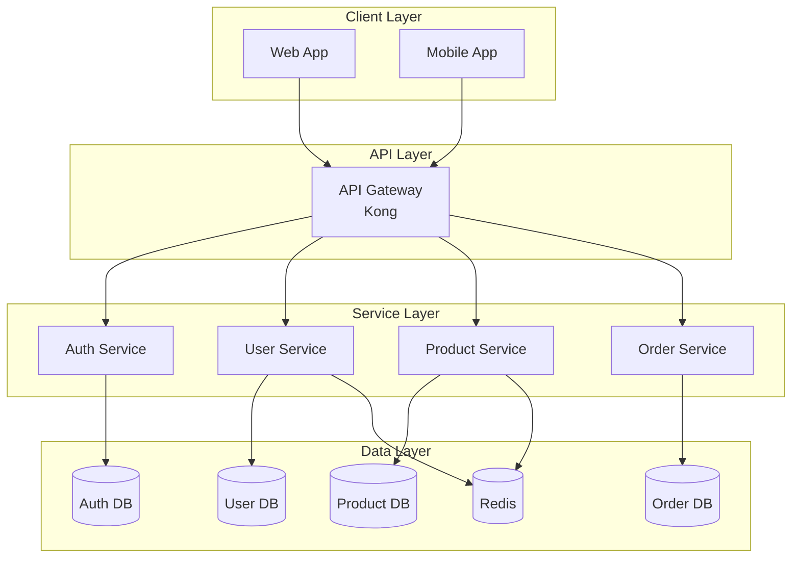
````

---

## 🌟 Recursos Avançados

### Links Clicáveis

````markdown
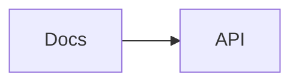
````

### Callbacks (Interatividade)

````markdown
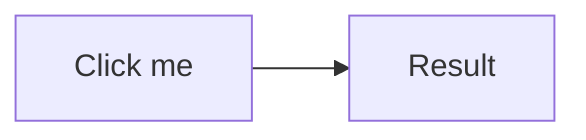
````

### Temas

````markdown
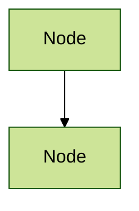
````

**Temas disponíveis:**
- `default`
- `forest`
- `dark`
- `neutral`
- `base`

---

## 📖 Referências

### Documentação Oficial
- **Mermaid:** https://mermaid.js.org/
- **Sintaxe:** https://mermaid.js.org/intro/syntax-reference.html
- **Exemplos:** https://mermaid.js.org/ecosystem/tutorials.html

### Ferramentas Úteis
- **Live Editor:** https://mermaid.live/
- **VS Code Extension:** Markdown Preview Mermaid Support
- **IntelliJ Plugin:** Mermaid

### Confluence
- **Macro:** https://marketplace.atlassian.com/apps/1222792/
- **Confluence API:** https://developer.atlassian.com/cloud/confluence/

---

## ✨ Próximos Passos

1. **Pratique:** Use o [Live Editor](https://mermaid.live/)
2. **Explore:** Teste todos os tipos de diagramas
3. **Documente:** Crie diagramas para seu projeto
4. **Compartilhe:** Ensine sua equipe

---

**Autor:** Documentação baseada na experiência do projeto Unigrande  
**Versão:** 1.0  
**Data:** Fevereiro 2026

*Happy Diagramming!* 🎨📊✨
