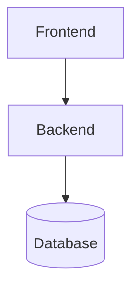
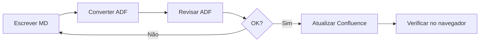
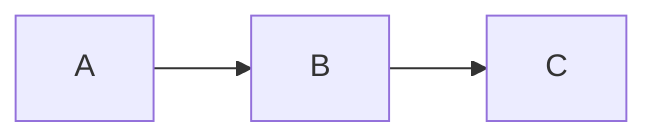
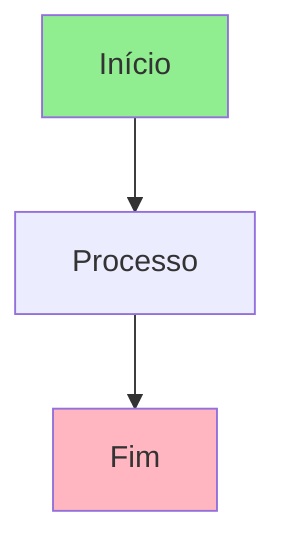
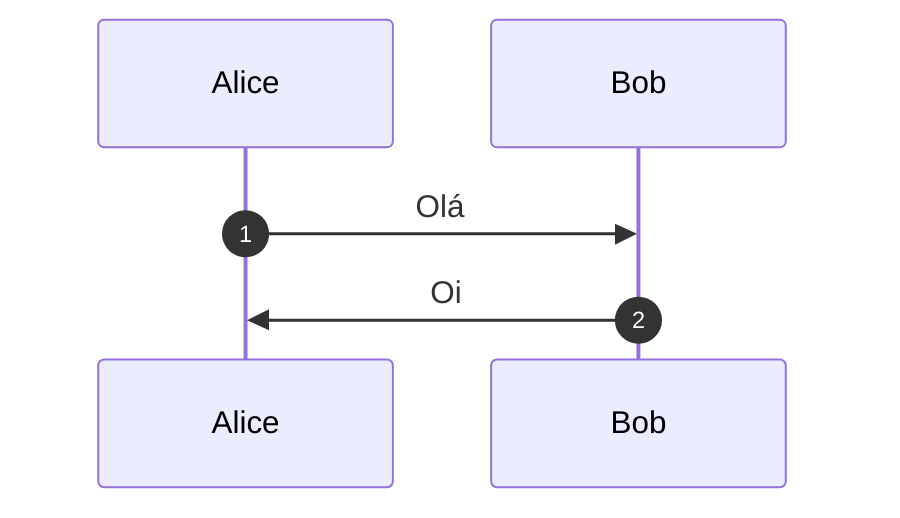
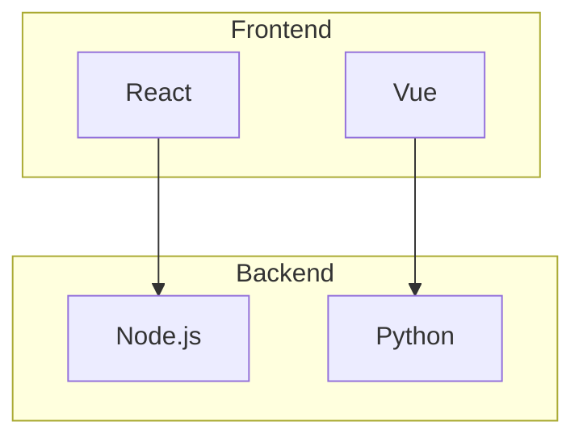

# 🚀 Quick Start Guide

Guia rápido para começar a usar o pacote Confluence Mermaid.

---

## 📦 Instalação (5 minutos)

### 1. Copie o pacote para seu projeto

```bash
# Navegue até seu projeto
cd /caminho/do/seu/projeto

# Copie o pacote
cp -r /caminho/confluence-mermaid-package ./

# Entre no diretório
cd confluence-mermaid-package
```

### 2. Configure credenciais

```bash
# Copie o template
cp config.template.js config.js

# Edite config.js com suas credenciais
# (use seu editor preferido)
```

**Preencha no `config.js`:**
- `email`: seu email do Atlassian
- `token`: gere em https://id.atlassian.com/manage-profile/security/api-tokens
- `cloudId`: veja como obter abaixo
- `spaceId`: veja como obter abaixo

**Como obter Cloud ID:**
```bash
curl -u seu-email@dominio.com:SEU_TOKEN \
  https://api.atlassian.com/oauth/token/accessible-resources
```

**Como obter Space ID:**
```bash
# Substitua CLOUD_ID e SPACE_KEY
curl -u seu-email:SEU_TOKEN \
  https://api.atlassian.com/ex/confluence/CLOUD_ID/wiki/api/v2/spaces?keys=SPACE_KEY
```

### 3. Adicione ao .gitignore

```bash
echo "config.js" >> .gitignore
```

---

## ✍️ Uso Básico (10 minutos)

### Passo 1: Escreva seu documento

Crie `meu-documento.md`:

````markdown
# Minha Documentação

## Arquitetura



## Descrição

Este sistema possui três camadas principais...
````

### Passo 2: Converta para ADF

```bash
node scripts/convert-md-to-adf.js meu-documento.md
```

Isso gera `meu-documento.adf.json`.

### Passo 3: Atualize no Confluence

```bash
node scripts/update-confluence-page.js -p 123456 -a meu-documento.adf.json
```

Onde `123456` é o ID da página do Confluence.

**Pronto!** 🎉 Sua página foi atualizada com o Mermaid renderizado.

---

## 🔄 Fluxo de Trabalho Recomendado



### 1. Desenvolvimento Local

```bash
# Escreva seus documentos
docs/
├── arquitetura.md
├── api-reference.md
└── guia-usuario.md
```

### 2. Conversão em Lote

```bash
# Converte todo o diretório
node scripts/convert-md-to-adf.js docs/
```

Gera:
```bash
docs/.adf-output/
├── arquitetura.adf.json
├── api-reference.adf.json
└── guia-usuario.adf.json
```

### 3. Atualização em Lote

Edite `scripts/batch-update-pages.js`:

```javascript
const PAGE_MAPPING = {
  '123456': 'arquitetura',
  '789012': 'api-reference',
  '345678': 'guia-usuario'
};
```

Execute:

```bash
node scripts/batch-update-pages.js
```

---

## 📊 Dicas de Mermaid

### Diagrama Simples

````markdown

````

### Diagrama com Estilo

````markdown

````

### Sequência Numerada

````markdown

````

### Com Subgrafos

````markdown

````

---

## 🐛 Troubleshooting Rápido

### ❌ Erro: "config.js não encontrado"

**Solução:**
```bash
cp config.template.js config.js
# Edite config.js com suas credenciais
```

---

### ❌ Erro: "401 Unauthorized"

**Causa:** Token inválido ou expirado

**Solução:**
1. Gere novo token: https://id.atlassian.com/manage-profile/security/api-tokens
2. Atualize em `config.js`

---

### ❌ Mermaid não renderiza

**Causa:** Macro não instalado

**Solução:**
1. Acesse: https://marketplace.atlassian.com/apps/1222792/mermaid-for-confluence
2. Instale o macro no seu Confluence
3. Teste novamente

---

### ❌ Página mostra texto plano (sem formatação)

**Causa:** Usando conversor antigo

**Solução:** Use o conversor deste pacote que gera ADF estruturado corretamente

---

## 📚 Recursos Úteis

### Documentação

- **Mermaid oficial:** https://mermaid.js.org/
- **Live Editor:** https://mermaid.live/
- **Confluence API:** https://developer.atlassian.com/cloud/confluence/rest/v2/

### Exemplos

```bash
# Veja os exemplos inclusos
ls examples/
# basic-example.md
# advanced-example.md
# all-diagrams.md
```

### Teste os exemplos

```bash
# Converta um exemplo
node scripts/convert-md-to-adf.js examples/basic-example.md

# Veja o ADF gerado
cat examples/basic-example.adf.json
```

---

## ✅ Checklist de Configuração

- [ ] Pacote copiado para o projeto
- [ ] `config.js` criado e preenchido
- [ ] `config.js` adicionado ao `.gitignore`
- [ ] Credenciais testadas (cloud ID, space ID, token)
- [ ] Macro Mermaid instalado no Confluence
- [ ] Primeiro documento convertido com sucesso
- [ ] Primeira página atualizada com sucesso
- [ ] Mermaid renderizando corretamente

---

## 🎯 Próximos Passos

Depois de configurar:

1. **Explore os exemplos** em `examples/`
2. **Converta sua documentação existente** para Markdown
3. **Configure batch update** para múltiplas páginas
4. **Documente seu processo** para a equipe
5. **Compartilhe o pacote** em outros projetos

---

## 💡 Dicas Avançadas

### Automatização com npm scripts

Adicione ao `package.json`:

```json
{
  "scripts": {
    "md2adf": "node scripts/convert-md-to-adf.js",
    "update": "node scripts/update-confluence-page.js",
    "batch": "node scripts/batch-update-pages.js"
  }
}
```

Uso:
```bash
npm run md2adf docs/
npm run batch
```

### CI/CD Integration

```yaml
# .github/workflows/update-confluence.yml
name: Update Confluence Docs

on:
  push:
    paths:
      - 'docs/**'

jobs:
  update:
    runs-on: ubuntu-latest
    steps:
      - uses: actions/checkout@v2
      - name: Update Confluence
        run: |
          cd confluence-mermaid-package
          node scripts/batch-update-pages.js
        env:
          CONFLUENCE_TOKEN: ${{ secrets.CONFLUENCE_TOKEN }}
```

---

**Tempo total de setup:** ~15 minutos  
**Dificuldade:** ⭐⭐☆☆☆ (Fácil)  
**Suporte:** Veja README.md completo
