# 📦 Confluence Mermaid Package

Pacote completo para criar documentação Confluence com suporte a **diagramas Mermaid renderizáveis** usando **Atlassian Document Format (ADF)** estruturado corretamente.

---

## 🎯 O que este pacote faz?

Este pacote permite converter documentos Markdown para o formato ADF do Confluence com:

- ✅ **Diagramas Mermaid renderizáveis** (usando macro `confluence-mermaid-macro`)
- ✅ **Estrutura ADF semântica correta** (headings, paragraphs, lists, tables)
- ✅ **Formatação inline** (bold, italic, code, links)
- ✅ **Blocos de código** com syntax highlighting
- ✅ **Tabelas** com bordas e formatação
- ✅ **Layout full-width para Mermaid** (usa toda largura disponível)
- ✅ **Encoding UTF-8** correto

---

## 📋 Requisitos

- **Node.js** 14+ (para executar os scripts)
- **Confluence Cloud** com acesso à API
- **Token de API** do Atlassian
- **Macro Mermaid instalado** no Confluence: [confluence-mermaid-macro](https://marketplace.atlassian.com/apps/1222792/mermaid-for-confluence)

---

## 🚀 Instalação

### 1. Copie o pacote para seu projeto

```bash
# Navegue até seu novo projeto
cd /caminho/do/seu/projeto

# Copie o diretório do pacote
cp -r /caminho/confluence-mermaid-package ./

# Entre no diretório
cd confluence-mermaid-package

# Instale as dependências
npm install
```

### 2. Configure suas credenciais

Copie o arquivo de configuração template:

```bash
cp config.template.js config.js
```

Edite `config.js` com suas credenciais:

```javascript
module.exports = {
  email: 'seu-email@dominio.com',
  token: 'SEU_TOKEN_ATLASSIAN_AQUI',
  cloudId: 'SEU_CLOUD_ID_AQUI',
  spaceId: 'SEU_SPACE_ID_AQUI'
};
```

**⚠️ IMPORTANTE:** Adicione `config.js` ao `.gitignore` para não commitar suas credenciais!

---

## 📖 Como Usar

### Passo 1: Escreva documentação em Markdown

Crie seus arquivos `.md` com diagramas Mermaid usando blocos de código:

````markdown
# Minha Documentação

## Arquitetura do Sistema

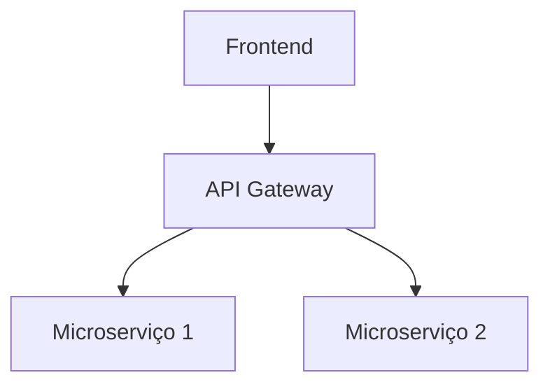

## Fluxo de Autenticação

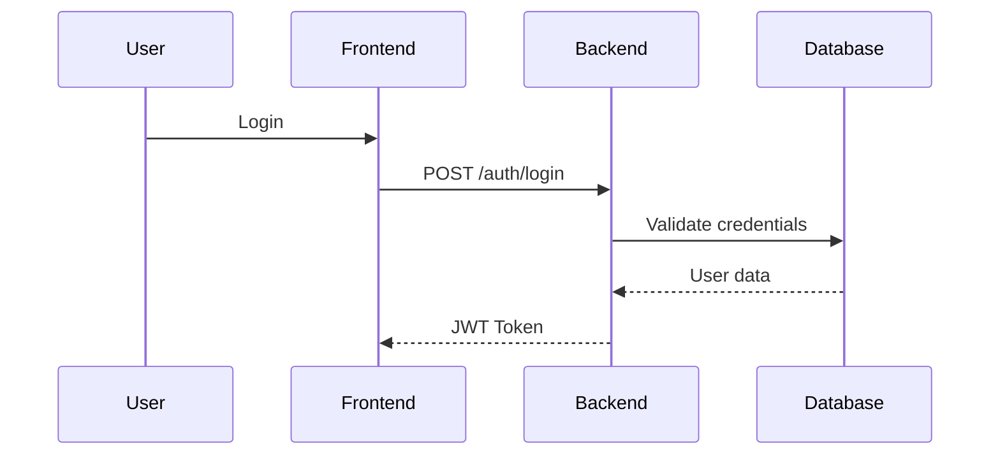
````

### Passo 2: Converta Markdown para ADF

```bash
node scripts/convert-md-to-adf.js caminho/do/arquivo.md
```

Isso gera um arquivo `arquivo.adf.json` com a estrutura ADF correta.

### Passo 3: Atualize página no Confluence

**Opção A: Atualização única**

```bash
node scripts/update-confluence-page.js --pageId 123456 --adf caminho/arquivo.adf.json
```

**Opção B: Atualização em lote (múltiplas páginas)**

Edite `scripts/batch-update-pages.js` com o mapeamento de páginas:

```javascript
const PAGE_MAPPING = {
  '123456': 'arquivo1',
  '789012': 'arquivo2',
  '345678': 'arquivo3'
};
```

Execute:

```bash
node scripts/batch-update-pages.js
```

---

## 🎨 Sintaxe Mermaid Suportada

### 1. Fluxogramas (Flowchart)

````markdown
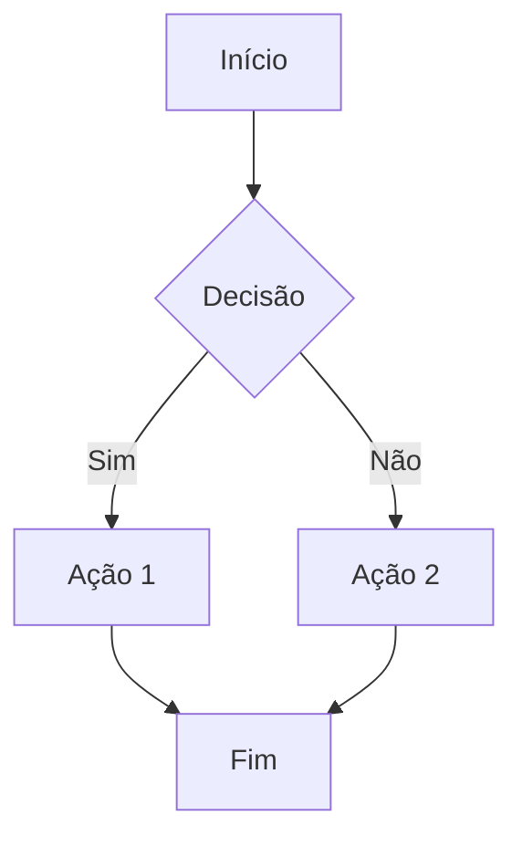
````

### 2. Diagramas de Sequência

````markdown
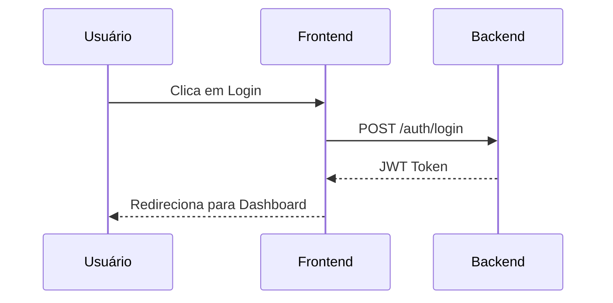
````

### 3. Diagramas de Classes

````markdown
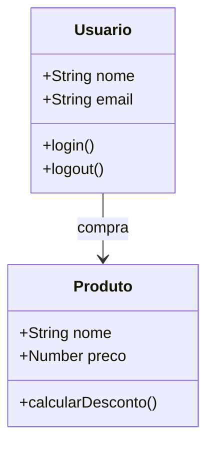
````

### 4. Diagramas de Estado

````markdown
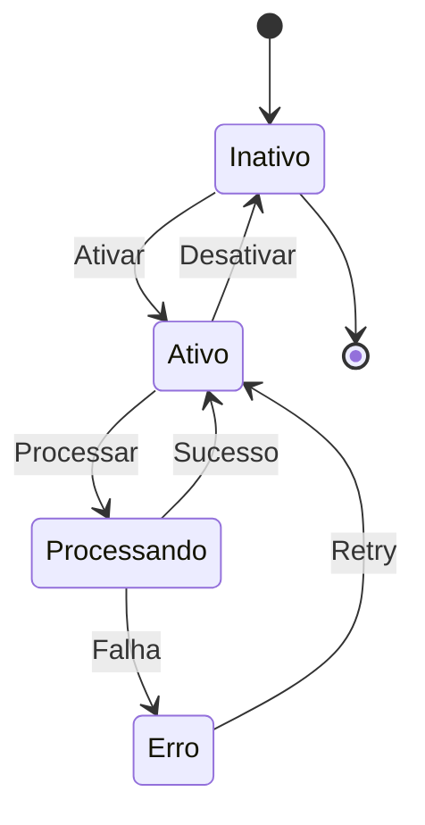
````

### 5. Diagramas ER (Entity-Relationship)

````markdown
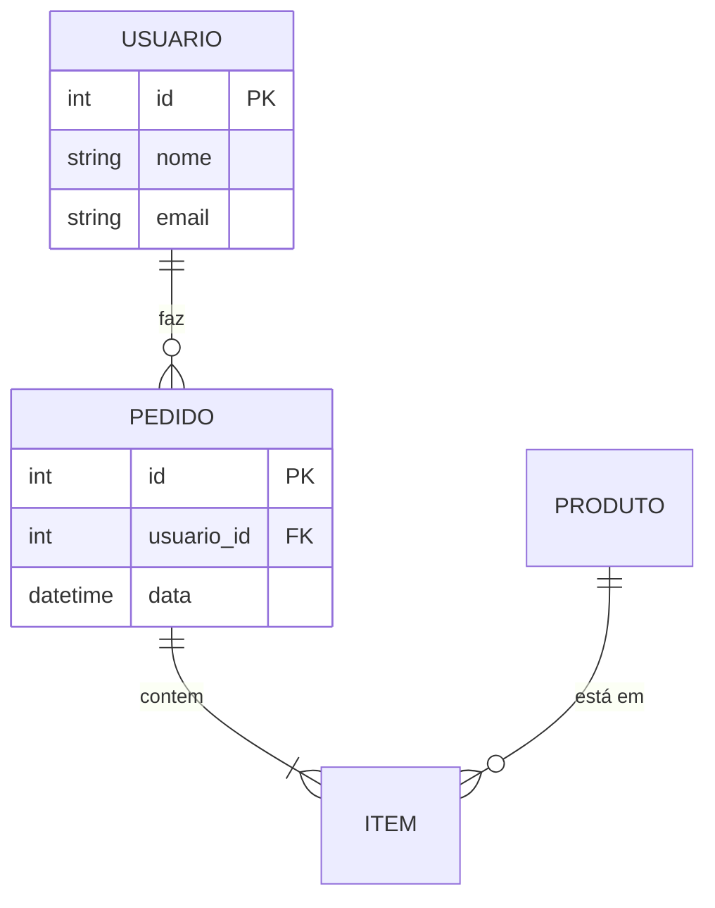
````

### 6. Gráficos de Gantt

````markdown
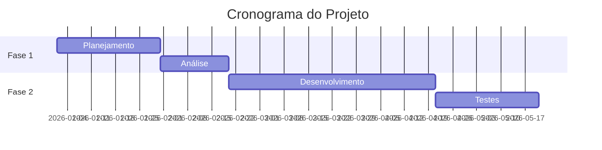
````

### 7. Diagramas de Jornada do Usuário

````markdown
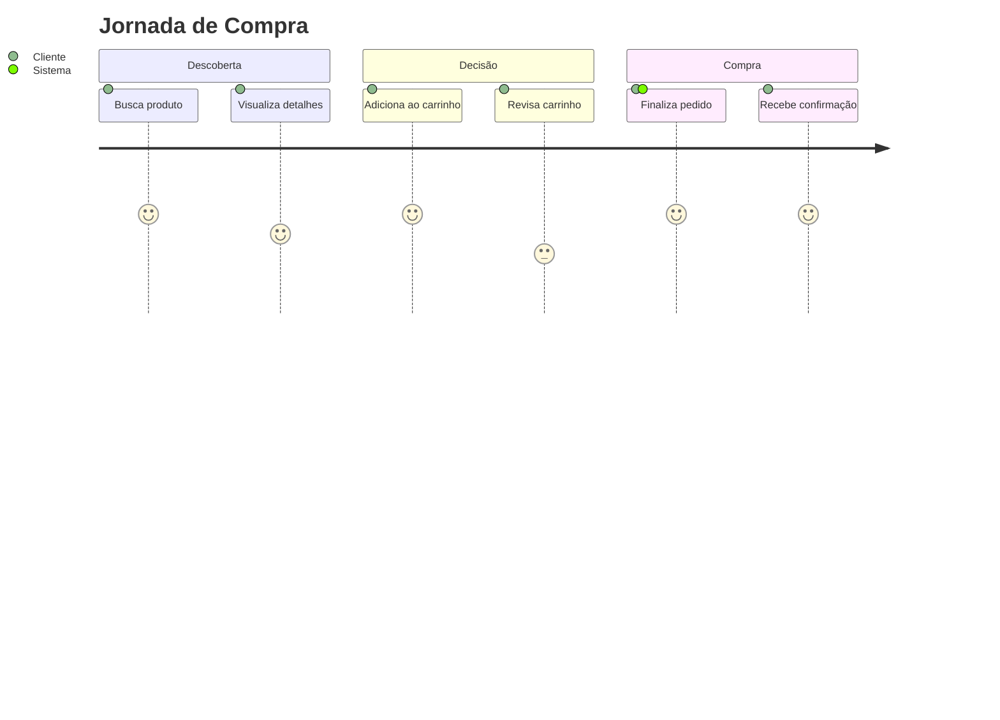
````

---

## 🔧 Configurações Avançadas

### Customizar Layout do Mermaid

Edite `scripts/convert-md-to-adf.js` na função que cria o macro:

```javascript
{
  type: 'bodiedExtension',
  attrs: {
    extensionType: 'com.github.busar.confluence.mermaid:mermaid-macro',
    extensionKey: 'mermaid-macro',
    parameters: {
      macroParams: {
        // Opções disponíveis:
        layout: 'full-width',    // 'default', 'full-width', 'center', 'align-start', 'align-end'
        alignment: {             // Alinhamento horizontal
          value: 'center'        // 'left', 'center', 'right'
        }
      }
    }
  }
}
```

### Adicionar mais tipos de blocos

Para adicionar suporte a novos tipos de blocos (ex: callouts, panels), edite a função `convertMarkdownToADF()` em `convert-md-to-adf.js`.

---

## 📁 Estrutura do Pacote

```
confluence-mermaid-package/
├── README.md                      # Esta documentação
├── package.json                   # Dependências Node.js
├── config.template.js             # Template de configuração
├── config.js                      # Suas credenciais (não commitar!)
├── .gitignore                     # Ignora config.js e arquivos ADF
├── scripts/
│   ├── convert-md-to-adf.js      # Conversor Markdown → ADF
│   ├── update-confluence-page.js  # Atualiza página única
│   └── batch-update-pages.js     # Atualiza múltiplas páginas
└── examples/
    ├── basic-example.md           # Exemplo básico
    ├── advanced-example.md        # Exemplo avançado
    └── all-diagrams.md            # Todos tipos de diagramas
```

---

## 🛠 Troubleshooting

### Problema: Mermaid não renderiza

**Causa:** Macro não instalado no Confluence

**Solução:** Instale o [Mermaid for Confluence](https://marketplace.atlassian.com/apps/1222792/mermaid-for-confluence)

---

### Problema: Erro 401 Unauthorized

**Causa:** Token inválido ou expirado

**Solução:** 
1. Gere novo token em: https://id.atlassian.com/manage-profile/security/api-tokens
2. Atualize `config.js` com o novo token

---

### Problema: Erro 400 "Only a Page with status DRAFT can have empty title"

**Causa:** Título da página não está sendo enviado corretamente

**Solução:** Certifique-se de que o script está extraindo o título do primeiro heading (`# Título`)

---

### Problema: Diagramas aparecem como texto plano

**Causa:** ADF estruturado incorretamente (conteúdo dentro de `paragraph` ao invés de `bodiedExtension`)

**Solução:** Use o conversor deste pacote que gera a estrutura correta

---

### Problema: Formatação inline não funciona (bold, italic)

**Causa:** Usando texto literal (`**bold**`) ao invés de marks array

**Solução:** O conversor deste pacote já usa estrutura correta com `marks: [{ type: 'strong' }]`

---

## 🔐 Segurança

**⚠️ NUNCA commite suas credenciais!**

Adicione ao `.gitignore`:

```gitignore
# Configuração com credenciais
config.js

# Arquivos ADF gerados (podem conter info sensível)
*.adf.json

# Logs
*.log
```

---

## 📚 Recursos Adicionais

### Documentação Oficial

- [Atlassian Document Format (ADF)](https://developer.atlassian.com/cloud/confluence/atlass-doc-format/)
- [Confluence REST API v2](https://developer.atlassian.com/cloud/confluence/rest/v2/intro/)
- [Mermaid Documentation](https://mermaid.js.org/)
- [Mermaid for Confluence Macro](https://marketplace.atlassian.com/apps/1222792/mermaid-for-confluence)

### Como obter IDs necessários

**Cloud ID:**
```bash
curl -u email@example.com:TOKEN \
  https://api.atlassian.com/oauth/token/accessible-resources
```

**Space ID:**
Abra sua página no Confluence e procure na URL:
```
https://yoursite.atlassian.net/wiki/spaces/SPACEKEY/...
```
Use a API:
```bash
curl -u email@example.com:TOKEN \
  https://api.atlassian.com/ex/confluence/CLOUD_ID/wiki/api/v2/spaces?keys=SPACEKEY
```

**Page ID:**
Está na URL da página:
```
https://yoursite.atlassian.net/wiki/spaces/SPACE/pages/123456/Page+Title
                                                          ^^^^^^
```

---

## 🧪 Testando o Pacote

1. **Teste a conversão:**
   ```bash
   node scripts/convert-md-to-adf.js examples/basic-example.md
   ```

2. **Verifique o ADF gerado:**
   ```bash
   cat examples/basic-example.adf.json | jq '.'
   ```

3. **Teste em página de desenvolvimento no Confluence** (recomendado antes de usar em produção)

---

## 📝 Exemplo Completo

```markdown
# Arquitetura do Sistema de Pagamentos

## Visão Geral

O sistema processa pagamentos usando arquitetura distribuída.

## Componentes Principais

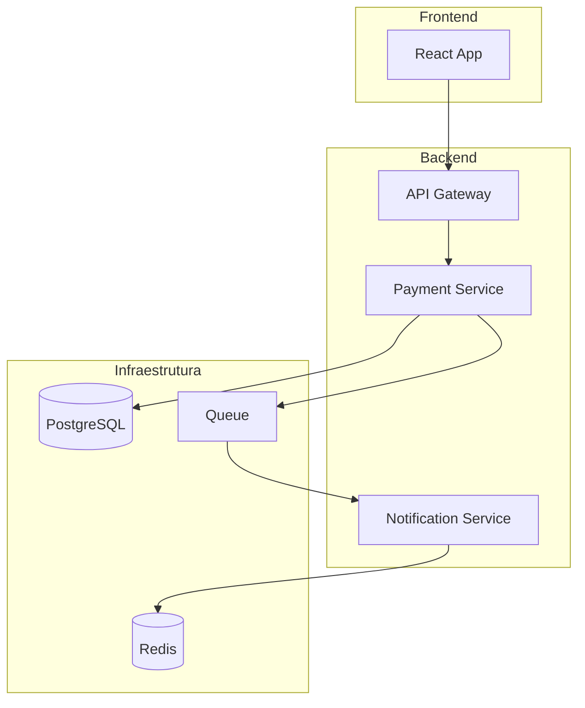

## Fluxo de Processamento

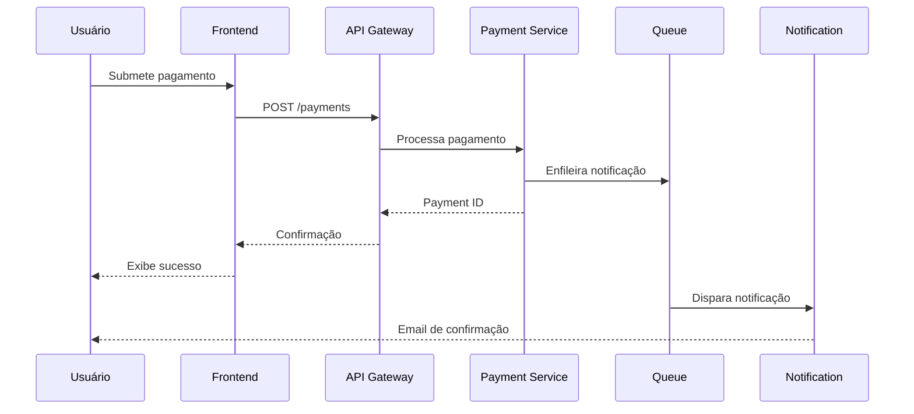

## Entidades de Dados

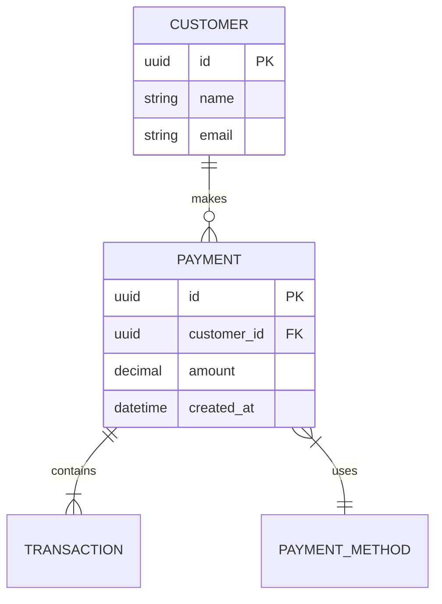
```

---

## 🎓 Boas Práticas

### 1. Organize seus diagramas

- Use diagramas simples e focados (uma responsabilidade por diagrama)
- Evite diagramas muito complexos (máximo 15-20 nós)
- Quebre diagramas grandes em múltiplos menores

### 2. Nomenclatura

- Use nomes descritivos nos nós
- Evite abreviações obscuras
- Seja consistente com termos técnicos

### 3. Cores e estilização

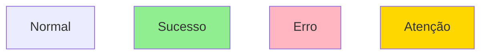

### 4. Versionamento

- Mantenha os arquivos `.md` no controle de versão
- Documente mudanças significativas nos diagramas
- Use branches para alterações grandes

---

## 🤝 Contribuindo

Se você melhorar este pacote, considere:

1. Documentar novas features
2. Adicionar exemplos
3. Atualizar este README
4. Compartilhar com a equipe

---

## 📄 Licença

Este pacote foi desenvolvido internamente para facilitar documentação técnica. Use livremente em seus projetos.

---

## 📞 Suporte

- **Documentação Mermaid:** https://mermaid.js.org/
- **API Confluence:** https://developer.atlassian.com/cloud/confluence/
- **Problemas com o conversor:** Abra issue no repositório interno

---

## 🎉 Créditos

Desenvolvido durante a restauração de emergência da documentação Confluence do projeto Unigrande (fevereiro 2026).

**Principais desafios resolvidos:**
- ✅ Estrutura ADF semântica correta (não mais texto plano em paragraphs)
- ✅ Mermaid renderizável com macro correto
- ✅ Layout full-width para diagramas
- ✅ Encoding UTF-8 preservado
- ✅ Batch restoration com 100% de taxa de sucesso

---

**Última atualização:** Fevereiro 2026  
**Versão:** 1.0.0
