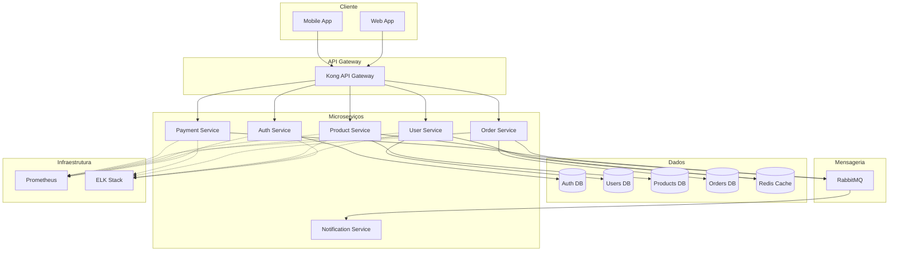
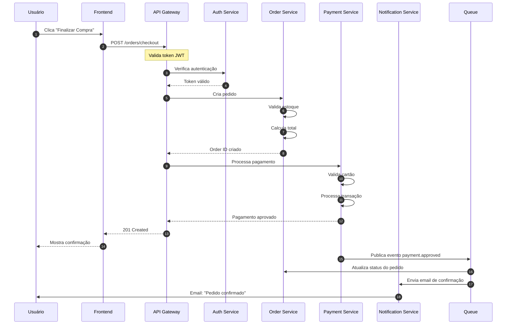
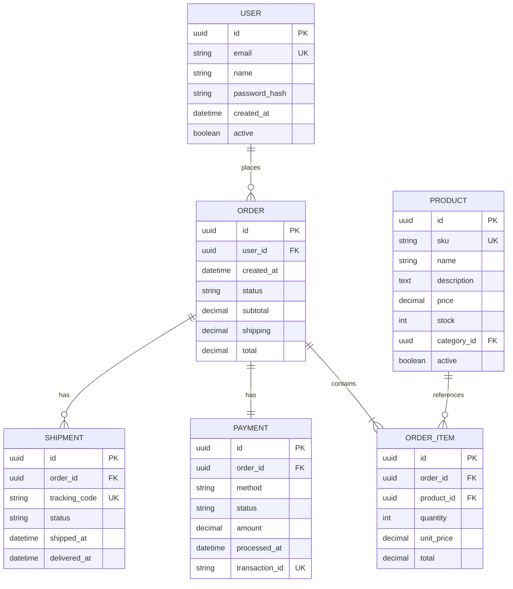
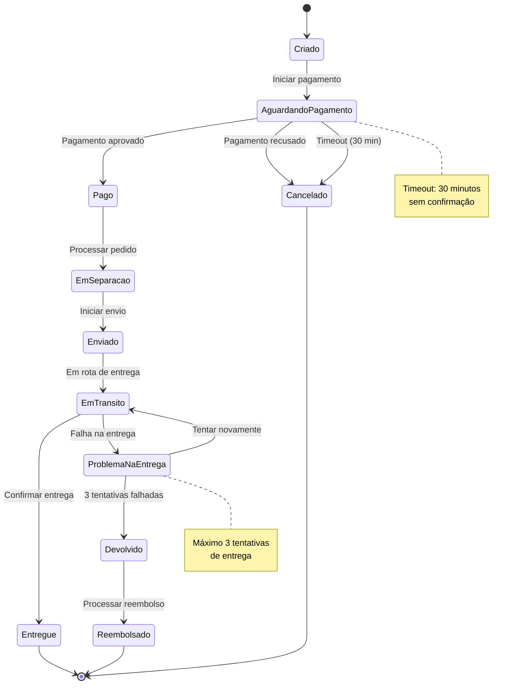
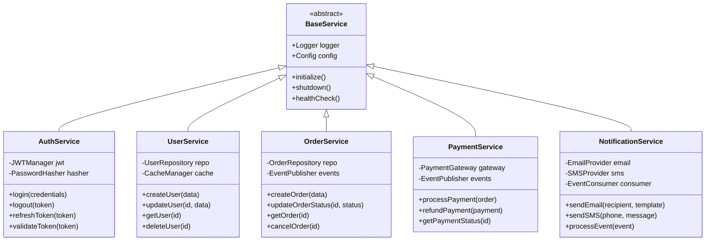
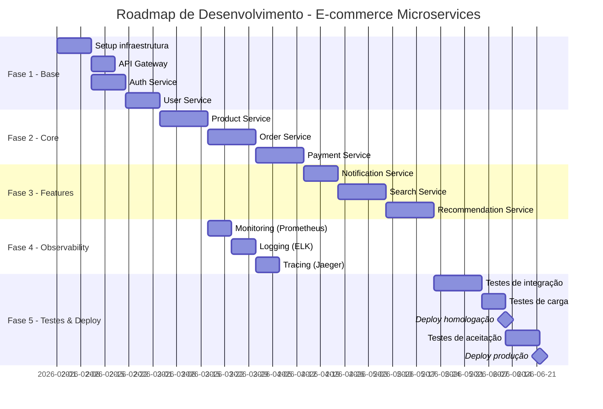

# Arquitetura de Microserviços - Sistema de E-commerce

## Visão Geral

Documentação técnica da arquitetura de microserviços do sistema de e-commerce.

---

## Arquitetura Geral

---

## Fluxo de Checkout

---

## Modelo de Dados

---

## Estados do Pedido

---

## Hierarquia de Serviços

---

## Cronograma de Implementação

---

## Tecnologias Utilizadas

| Categoria | Tecnologia | Versão |
|-----------|-----------|--------|
| **Runtime** | Node.js | 20.x |
| **Framework** | NestJS | 10.x |
| **API Gateway** | Kong | 3.x |
| **Banco de Dados** | PostgreSQL | 15.x |
| **Cache** | Redis | 7.x |
| **Mensageria** | RabbitMQ | 3.12 |
| **Monitoring** | Prometheus + Grafana | Latest |
| **Logging** | ELK Stack | 8.x |
| **Containerização** | Docker | 24.x |
| **Orquestração** | Kubernetes | 1.28 |

---

## Padrões de Comunicação

### Síncrona (REST)
- User → Auth Service
- Frontend → API Gateway
- Gateway → Microserviços

### Assíncrona (Message Queue)
- Payment → Notification
- Order → Inventory
- Audit events

---

## Próximos Passos

1. ✅ Implementar Auth Service
2. ✅ Implementar User Service
3. 🔄 Implementar Product Service
4. ⏳ Implementar Order Service
5. ⏳ Implementar Payment Service
6. ⏳ Setup monitoring
7. ⏳ Testes de carga

---

**Documentado por:** Equipe de Arquitetura  
**Última atualização:** Fevereiro 2026  
**Versão:** 2.0
