# Guia Completo de Diagramas Mermaid

Exemplos de todos os tipos de diagramas Mermaid suportados.

---

## 1. Fluxograma (Flowchart)

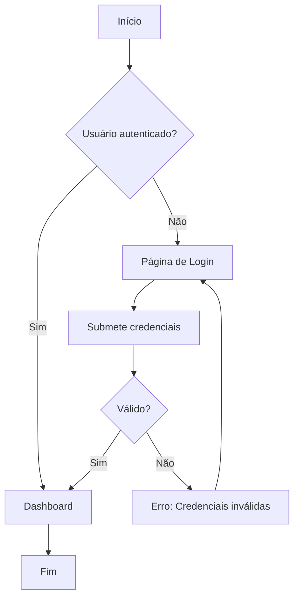

---

## 2. Diagrama de Sequência

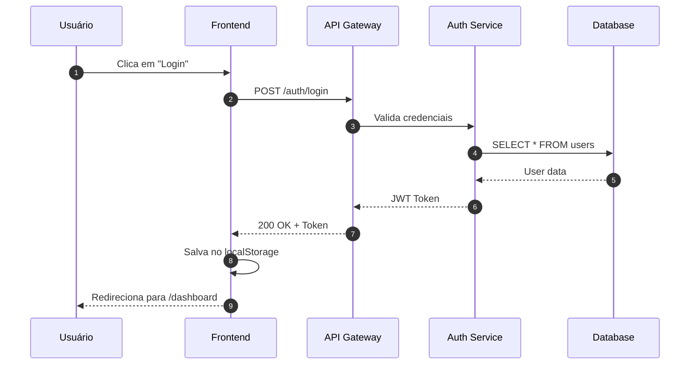

---

## 3. Diagrama de Classes

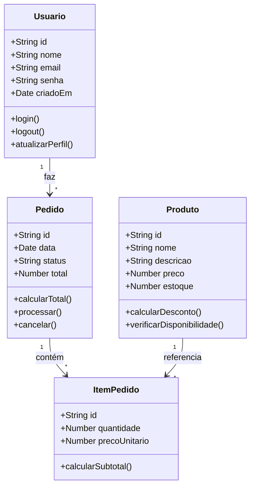

---

## 4. Diagrama de Estado

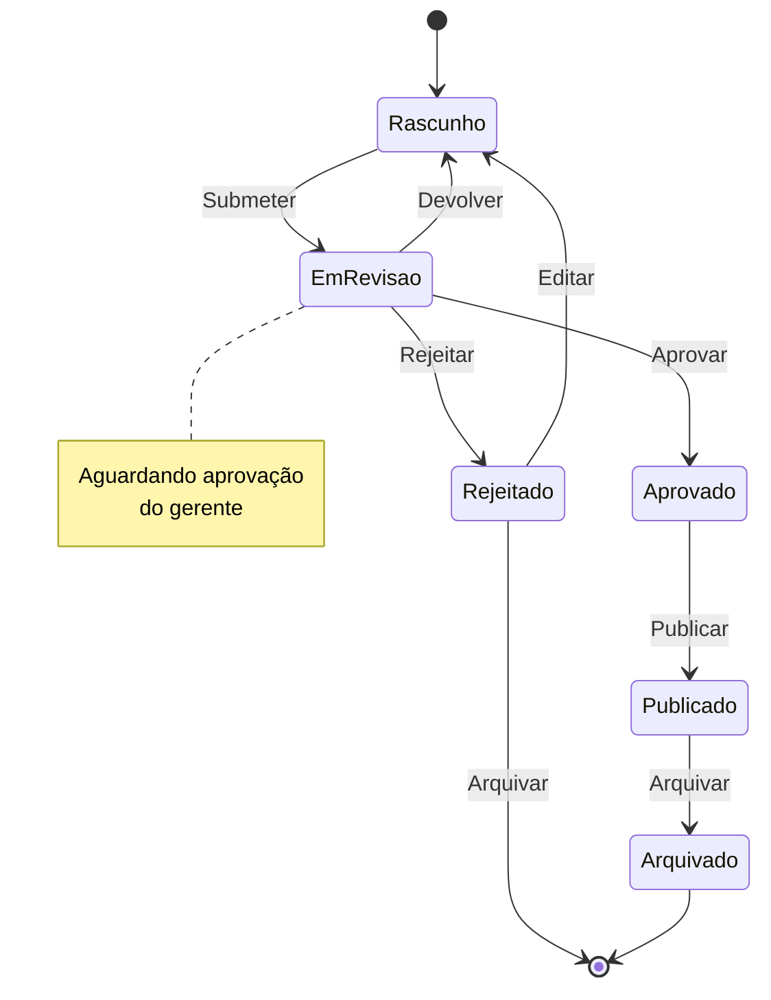

---

## 5. Diagrama ER (Entity-Relationship)

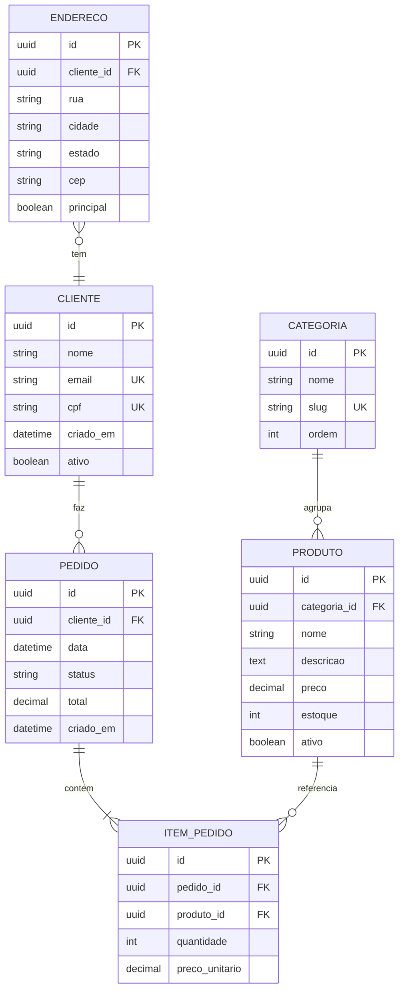

---

## 6. Gráfico de Gantt

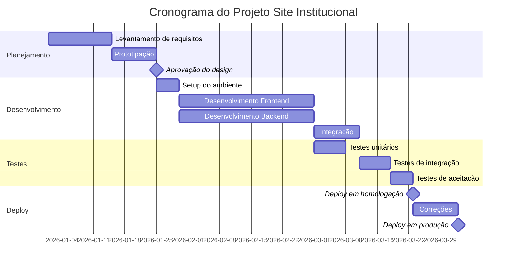

---

## 7. Gráfico de Pizza (Pie Chart)

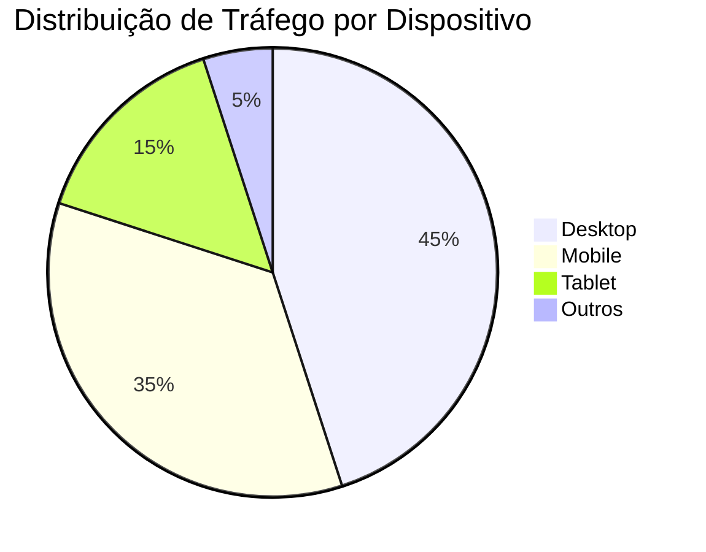

---

## 8. Jornada do Usuário (User Journey)

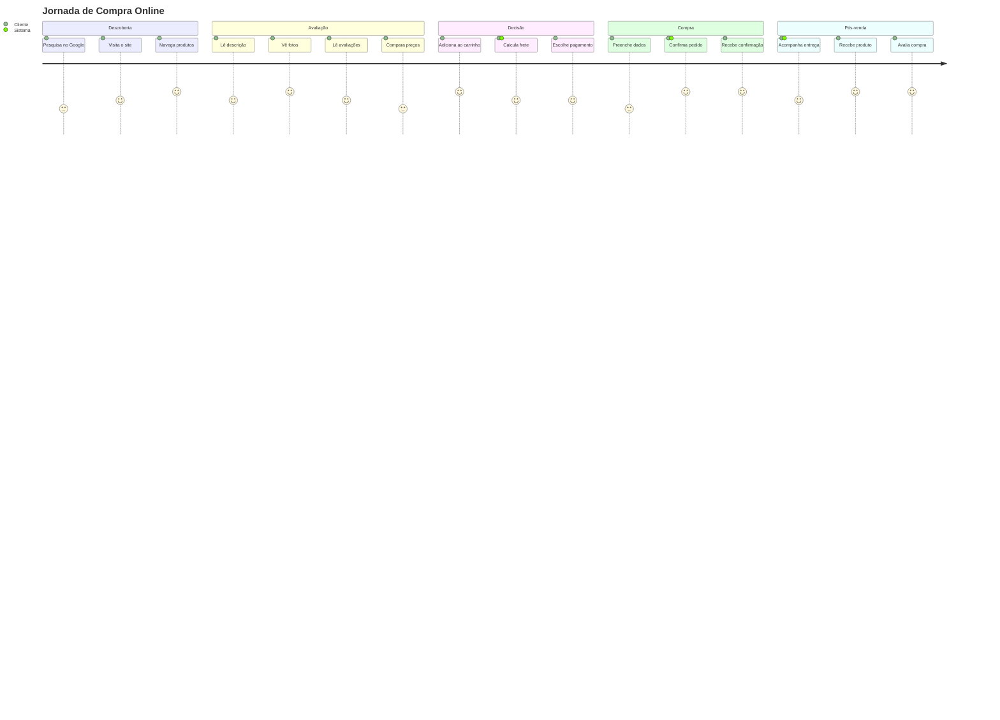

---

## 9. Git Graph

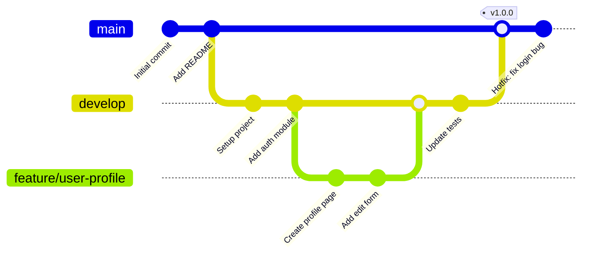

---

## 10. Mindmap

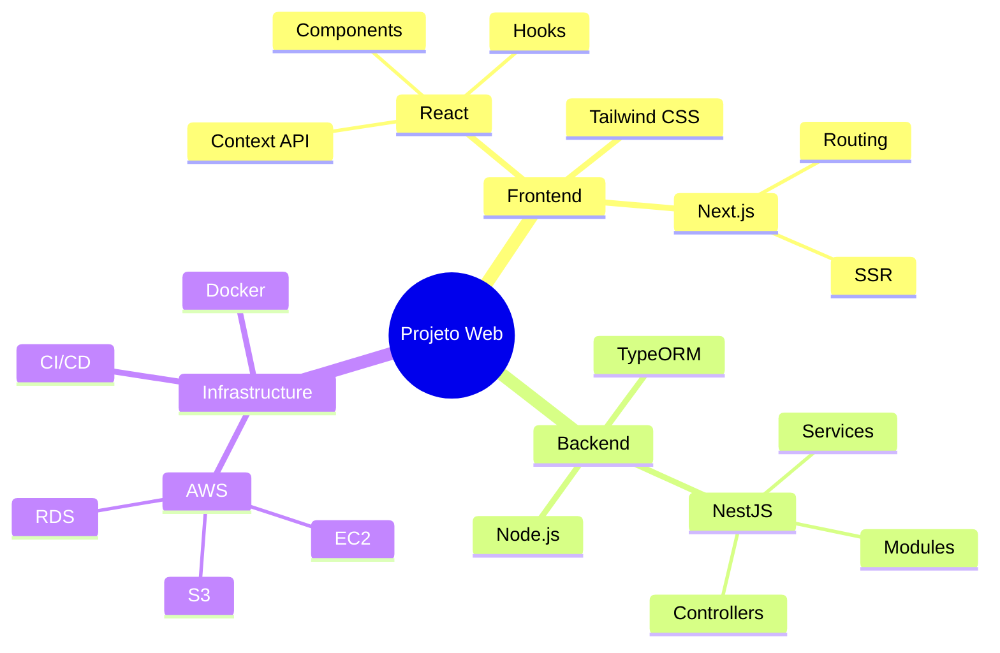

---

## 11. Timeline

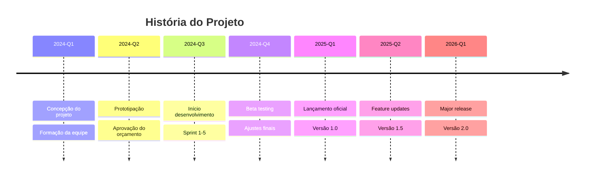

---

## 12. Quadrantes

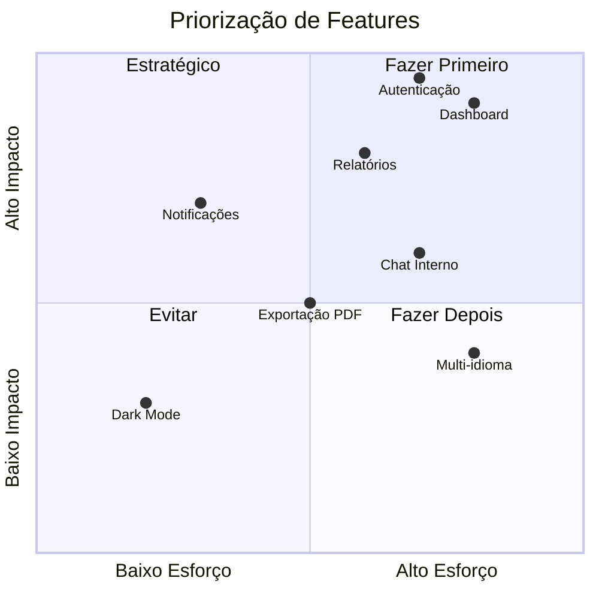

---

## Dicas de Uso

1. **Simplicidade**: Mantenha diagramas simples e focados
2. **Cores**: Use estilos para destacar elementos importantes
3. **Legendas**: Adicione notas explicativas quando necessário
4. **Tamanho**: Evite diagramas muito grandes (max 20-25 nós)
5. **Consistência**: Use nomenclatura consistente

---

**Referências:**
- [Documentação Oficial Mermaid](https://mermaid.js.org/)
- [Mermaid Live Editor](https://mermaid.live/)
- [Confluence Mermaid Macro](https://marketplace.atlassian.com/apps/1222792/)
