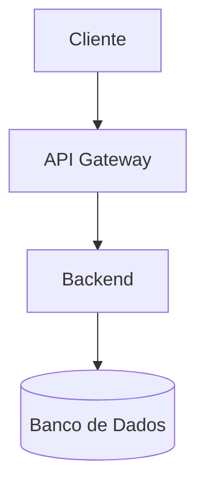
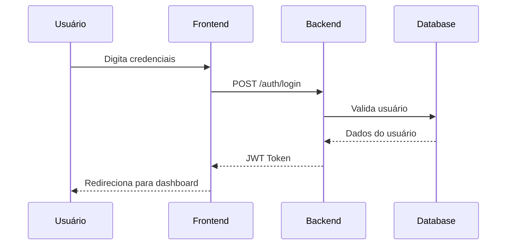

# Exemplo Básico - Documentação com Mermaid

## Introdução

Este é um exemplo básico de documentação usando **Markdown** com diagramas **Mermaid**.

## Arquitetura do Sistema

O sistema possui uma arquitetura simples de três camadas:



## Componentes Principais

### Frontend
- Interface web responsiva
- React.js
- State management com Redux

### Backend
- API REST em Node.js
- Express framework
- Autenticação JWT

### Banco de Dados
- PostgreSQL
- Redis para cache

## Fluxo de Autenticação



## Código de Exemplo

```javascript
async function login(email, password) {
  const response = await fetch('/api/auth/login', {
    method: 'POST',
    headers: { 'Content-Type': 'application/json' },
    body: JSON.stringify({ email, password })
  });
  
  const { token } = await response.json();
  localStorage.setItem('authToken', token);
  
  return token;
}
```

## Recursos

- **Documentação completa**: https://docs.exemplo.com
- **API Reference**: https://api.exemplo.com/docs
- **Suporte**: suporte@exemplo.com

---

**Última atualização:** Fevereiro 2026
